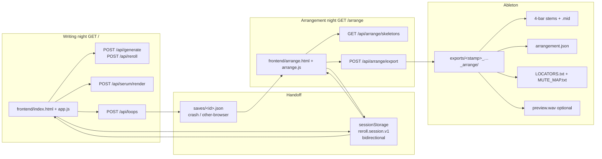

# Subtractive Arranger (`/arrange`)

| Field | Value |
| --- | --- |
| **Status** | Draft |
| **Author** | Austin Russell |
| **Date** | 2026-08-12 |
| **App** | Reroll (`C:\Users\russe\desktop\reroll`) |
| **Route** | `GET /arrange` (second page on the existing FastAPI server — not a new repo) |
| **Metric** | Time from a locked writing-night loop to a ~4-minute form you would ship. Target **< 15 minutes**. |

---

## Overview

Reroll already solves writing night: pick from the local Splice + Serum libraries, lock keepers, dice the rest, bounce 4-bar stems, hand off to Ableton. Tracks still die on **arrangement night**, which the artist plan names as the **8-bar loop trap** (`C:\Users\russe\desktop\edm-music-working\edm-music-plan.md`).

This design adds a second page, `/arrange`, that never adds parts. The user **stamps** the locked loop across a **~4-minute** grid of **8-bar blocks**, picks a **job** (stock mute skeleton), **carves** cells to `on` / `off` / `thin`, listens in an 8- or 16-bar brace, and exports a Live-ready folder: existing-style stems + `arrangement.json` + a typable locator sheet + optional preview mix. Mixing, risers, and finishing stay in Ableton. `.als` arrangement clips are explicitly **out of v1**.

The artist plan originally described 6–7 minute DJ-tool forms. This product does **not**. Target length is **~4 minutes**; that is the ceiling, not a floor. Shorter ideas (2–3 min) are in scope. Club-length intros/outros are not.

---

## Background & Motivation

### Current state (writing night)

| Piece | Where it lives | What it does |
| --- | --- | --- |
| Session | `frontend/app.js` `state` (`trackOrder`, `slots`, `options`) | Dynamic tracks; lock / mute / solo / dice |
| Loop length | `frontend/app.js` `LOOP_BARS = 4`; `backend/timing.py` `LOOP_BARS = 4` | Hard-coded 4 bars. `tests/unit/test_timing.py::test_loop_bars_is_four` pins this. |
| Roles | `backend/generate.py` `SLOT_ROLES`, `SAMPLE_SLOT_TYPES`, `generate_tracks()` | Kick/hats/clap/perc + Serum/audio musical types; track ids `kick` or `kick__2` |
| Preview | Web Audio look-ahead scheduler in `app.js` | Space play/stop; kick-locked phrase beds; Serum bounce via `POST /api/serum/render` |
| Undo | `pushUndo` / `captureDocSnapshot` / `restoreDocSnapshot` | 40-step stack; Ctrl+Z / Ctrl+Y |
| Saves | `POST /api/loops` → `saves/<id>.json` | See [Save JSON](#save-json-today) |
| Export | `POST /api/export` → `backend/export_loop.export_loop()` | Flat `exports/<stamp>_<slug>/` + `ABLETON_DROP/` + User Library `Samples/Reroll` |
| `.als` | `backend/export_als.write_als_project()` | Optional; Live 12 open still untrusted. Arrangement clips gated by `REROLL_ALS_ARRANGEMENT` (code default `"1"`). |

Reroll’s own README still lists “Full song arrangement” as a non-goal. That remains true for *finishing*. This page only answers: **when is each locked stem allowed to speak?**

### Pain

- An inspiring 4-bar loop exists; a **short, shippable form** (~4 min) does not.
- Arrangement night in Live starts from a blank timeline. The plan already specifies the method: **subtractive** (stamp full loop, then delete), **job-first** (“130 BPM peak-time melodic techno tool”), **8-bar multiples**, phase-separated from writing and mix. The plan’s 6–7 minute DJ-tool length is **rejected here** — jobs are compact streaming-length ideas, not peak-time DJ tools.
- Generating `.als` arrangement clips is the wrong first bet. `docs/ALS_EXPORT_STATUS.md` documents a long crash history. Even after the 2026-08-11 schema fixes, **pytest cannot open Live**. v1 must not wait on that.

### Upstream, out of scope

**Resampler** (`C:\Users\russe\desktop\resampler`) is a melody-aware chopper. Its bounced vocal/lead WAVs may already sit on a reroll track as `lead_audio` / `vocal`. The arranger treats them as any other locked stem. No resampler API, no in-arranger chop.

---

## Goals & Non-Goals

### Goals

1. Second page on the **existing** uvicorn process (`python -m uvicorn backend.app:app`), route `/arrange`.
2. Input: current (or saved) reroll session — tracks, BPM, key, style, MIDI/macros. Sounds do not change on this page.
3. Object model: `blocks` × track grid of `on` | `off` | `thin`, block size **8 bars**, default blank stamp **16 blocks** (4:00 @ 128). Hard cap **20 blocks** (5:00 @ 128).
4. Three hard-coded **jobs** (mute presets, not compositions) with concrete locators, all **16 blocks**.
5. Brace listen: 8 or 16 bars, `[` `]` nudge by 8 bars, Space play/stop.
6. Row locks with the same mental model as writing-night track lock (`state.slots[id].locked`).
7. Export **without** `.als`: `arrangement.json`, one loop-length stem per role (existing bounce path), locator sheet, optional preview WAV.
8. Persist `{ job, bars, mask, locators }` on the existing save document.
9. **< 15 minutes** locked-loop → a ~4-minute form you would ship.

### Non-goals (v1)

- Adding parts, fills, risers, transitions, or any Suno-adjacent auto-compose
- Mix, sidechain, return FX, clip gain automation as a mix
- Variable clip lengths, warp UI, 16th-note arrangement editing
- Finish-in-browser song; replacing Ableton; cloud / AI full-track generation
- Changing writing-night `LOOP_BARS` from 4 → 8
- Reference-track tap-along skeletons (v1.1)
- User-named skeletons (after v1 persist)
- Real `.als` arrangement clips + Live locators (v1.5, gated on cold-open)

---

## Key Decisions

| Decision | Choice | Rationale |
| --- | --- | --- |
| Where it lives | Second page `/arrange` on `backend.app:app`, new `frontend/arrange.html` + `arrange.js` | Product decision. Do not load `app.js` (Ctrl+R reroll, MIDI editors, kid-time). Share `styles.css`. |
| Phase split | Separate *use*, same install | Writing night and arrangement night stay mentally separate; one `uvicorn` is enough. |
| Grid unit | **8-bar blocks only** | Artist-plan 8-bar multiples. No beat/16th editing. |
| Writing loop length | **Leave `LOOP_BARS = 4`** | Pinned by `test_loop_bars_is_four`. Stamp tiles `8 / LOOP_BARS` loops per block (2 today). |
| Target length | **~4 minutes.** Default + all three jobs = **16 blocks**. Min 8, max 20. | Shipping short ideas, not DJ-tool epics. 16 × 8 = 128 bars = **4:00 @ 128**, **4:08 @ 124**, **3:53 @ 132**. 20-block cap is a nudge ceiling (5:00 @ 128), not a second job size. |
| Job vs session BPM | Applying a job **does not** change session BPM/key | Warp today is `playbackRate` (`docs/SAMPLE_WARP.md`). Changing BPM would chipmunk every stem. Job BPM is a label / hint only. |
| Rows | Session **track ids** (`state.trackOrder`), not a fixed 7-row UI | Matches `generate_tracks()` / `newTrackId()`. Skeletons key off **canonical roles**; extra tracks default `on`. |
| `thin` | Intent mark. Preview gain **0.35** (−9 dB). Export stems stay full-level. | “The app does not mix.” Live does filter/volume later. |
| Cell cycle | `on → thin → off → on` | Three states from day one so we don’t migrate the mask later. |
| First paint | **Stamp = all `on`**. Job is a separate click. | Flow: Stamp → job → Carve. Don’t auto-apply a genre. |
| `/` ↔ `/arrange` session | One bidirectional `sessionStorage` key `reroll.session.v1`. `goArrange()` on `/` is the **only** `serializeLoop` + `writeSessionDoc` caller. `/arrange` read-modify-writes the loaded blob (`arrangement` / `saved_at` / `id` / `name` only). `init()` restores instead of `doGenerate` but still `await loadLibrary()` first. | `serializeLoop` reads `#bpm` / `#key` / `#style` (`app.js` ~4515–4552). Arrange must not load `app.js`. Re-serializing there would wipe BPM/key/midi. |
| Sounds on this page | Read-only. No generate / dice / add-track / MIDI edit. | Product: this screen does not reroll. |
| Export | `POST /api/arrange/export` calls `export_loop(..., write_als=False, sync_ableton_drop=False, sync_user_library=False)`, writes extras, then **one** `_mirror_flat` pass | Caller cannot append to `export_loop`’s local `written` after return. Second/disabled sync is required. |
| Preview listen | Browser, **brace only** (8/16 bars). After navigation, re-fetch: samples `/api/audio`, Serum `POST /api/serum/render` | `bufferCache` dies on full-page load. No stored bounce URLs on slots today. |
| Preview WAV | **Export-only**, default on, written next to stems after they exist. No standalone preview endpoint. | Tiler needs 4-bar stems from `export_loop`. Brace listen must not call this. |
| Persistence | Optional `arrangement` key on `saves/*.json`. Keep `version: 1`. Save **reconciles** mask to current `track_order` (pad `on` / drop orphans). | Writing-page Save must not 422 when a track was added after Arrange. |
| `.als` | v1.5 only, after Austin cold-opens a current set in Live 12.2.6 | `docs/ALS_EXPORT_STATUS.md`; today’s `_place_arrangement_clips()` writes **one 4-bar clip at t=0**, not a mute map. |
| Library persist | Do not touch `backend/persist.py` | That module is **SQLite `library.db`**, not session saves. Session I/O is `save_loop` / `get_loop` in `backend/app.py`. |

---

## Proposed Design

### Architecture



Same process, same catalog, same Serum worker (`_HOST_WORKER` in `backend/app.py`). No new host.

### User flow

```mermaid
sequenceDiagram
  actor U as Austin
  participant W as GET /
  participant S as sessionStorage / saves/
  participant A as GET /arrange
  participant API as FastAPI
  participant E as exports/

  U->>W: Lock keepers (existing padlock)
  U->>W: Arrange
  W->>W: lock filled tracks; serializeLoop + writeSessionDoc
  W->>S: reroll.session.v1
  W->>A: navigate /arrange
  A->>S: readSessionDoc() (else GET /api/loops/{id}) → keep blob
  A->>API: GET /api/arrange/skeletons
  U->>A: Stamp / job / carve / lock
  A->>S: patchSessionDoc(arrangement) only
  U->>A: Space / [ ] / ]
  A->>API: samples /api/audio · Serum POST /api/serum/render
  A->>A: Web Audio brace (8 or 16 bars)
  U->>A: Export
  A->>API: POST /api/arrange/export
  API->>E: stems via export_loop(write_als=False, sync_*=False)
  API->>E: extras + one _mirror_flat + optional preview.wav
  API-->>A: folder
  A->>API: POST /api/export/open (select LOCATORS.txt)
  U->>A: ← Loop
  A->>S: patchSessionDoc(arrangement)
  A->>W: navigate /
  W->>S: readSessionDoc(); applyLoadedLoop; skip doGenerate
```

### Session continuity (`reroll.session.v1`)

Full-page navigation (`window.location.href = "/arrange"` / `"/"`) destroys JS heap and `bufferCache`. Today `init()` (`frontend/app.js` ~5587–5611) **always** runs `initDefaultTracks()` then `doGenerate({ autoPlay: false })`. There is no `sessionStorage` / `localStorage` / `beforeunload` restore. A one-way arrange handoff plus `← Loop` → `/` would **regenerate a new loop**.

**Contract (PR 2, not persist polish):**

| | |
| --- | --- |
| Key | `sessionStorage["reroll.session.v1"]` |
| Shape | Snapshot taken **once** on `/` via `serializeLoop()` (`name`, `bpm`, `key`, `style`, `options`, `track_order`, `slots`, `id`) plus `version: 1`, `saved_at`, and `arrangement` (`null` until first stamp/job) |
| Write on `/` | **`goArrange()` is the only `serializeLoop` + `writeSessionDoc` caller.** After locking filled tracks on `state.slots`. `serializeLoop` reads writing-page DOM (`getBpm()` → `#bpm`, `$("#key")`, `$("#style")`, `readSerumEngineOptionsFromDom()` at `app.js` ~4515–4552). That is correct **only** while `index.html` is mounted. |
| Write on `/arrange` | **Never call `serializeLoop` or `writeSessionDoc`.** Keep the loaded blob in `sessionDoc`. `patchSessionDoc({ arrangement })` after undoable edits (coalesce ~2.5 s) and on `← Loop`. After Arrange Save, also patch `id` / `name` from the POST response. Never re-derive `bpm` / `key` / `style` / `options` / `track_order` / `slots` from arrange DOM (there is no `#bpm`; inventing defaults would wipe 128 → 140 and drop `midi` / `macros`). |
| Read on `/arrange` | Valid doc → assign `sessionDoc`, display `sessionDoc.bpm` / `.key` as text. Else `?loop=` → `GET /api/loops/{id}` becomes `sessionDoc` and is written through to `sessionStorage` so `← Loop` works. Else empty state. |
| Read on `/` | `init()` **always** `await loadLibrary()` (today it runs after `initDefaultTracks`; keep it before generate). Then `restoreOrGenerate()`: valid doc → `applyLoadedLoop` / **skip** `initDefaultTracks` + `doGenerate`. No doc → `initDefaultTracks()` + `doGenerate`. Session BPM/key/slots win over `user_settings.json`. |
| Valid | `version === 1`, `track_order` is a non-empty array, `slots` is an object |
| Lock | Before `writeSessionDoc` on Arrange click, set `slots[id].locked = true` for every id with a `path`. Empty tracks stay unlocked. Those flags live **in the session doc**. |
| Disk | `saves/` + `?loop=` is crash / other-browser backup (PR 5). The 15-minute round-trip must not require a named save. |

`readSessionDoc` is a 10-line JSON parse — duplicate it in `app.js` and `arrange.js`. Do **not** share `serializeLoop`.

```javascript
// frontend/app.js only
const SESSION_KEY = "reroll.session.v1";

function writeSessionDoc() {
  const body = {
    version: 1,
    saved_at: new Date().toISOString(),
    ...serializeLoop(state.currentLoopName || defaultLoopName()),
    arrangement: state.arrangement || null,
  };
  sessionStorage.setItem(SESSION_KEY, JSON.stringify(body));
}

function readSessionDoc() {
  try {
    const doc = JSON.parse(sessionStorage.getItem(SESSION_KEY) || "null");
    if (!doc || doc.version !== 1) return null;
    if (!Array.isArray(doc.track_order) || !doc.track_order.length) return null;
    if (!doc.slots || typeof doc.slots !== "object") return null;
    return doc;
  } catch {
    return null;
  }
}

// Replace the tail of init() after loadUserSettings:
//   initDefaultTracks();
//   await loadLibrary();
//   await doGenerate({ autoPlay: false });
async function initAfterSettings() {
  await loadLibrary(); // always — library panel / later dice, including restore path
  await restoreOrGenerate();
}

async function restoreOrGenerate() {
  const doc = readSessionDoc();
  if (doc) {
    applyLoadedLoop(doc);
    state.arrangement = doc.arrangement || null;
    if (doc.id) state.currentLoopId = doc.id;
    if (doc.name) state.currentLoopName = doc.name;
    setStatus("Restored session");
    return;
  }
  initDefaultTracks();
  await doGenerate({ autoPlay: false });
}
```

```javascript
// frontend/arrange.js — must not load app.js, must not call serializeLoop
let sessionDoc = null; // blob from sessionStorage or GET /api/loops/{id}

function patchSessionDoc(fields) {
  if (!sessionDoc) return;
  const allowed = {};
  if ("arrangement" in fields) allowed.arrangement = fields.arrangement;
  if ("id" in fields) allowed.id = fields.id;
  if ("name" in fields) allowed.name = fields.name;
  sessionDoc = {
    ...sessionDoc,
    ...allowed,
    saved_at: new Date().toISOString(),
  };
  sessionStorage.setItem(SESSION_KEY, JSON.stringify(sessionDoc));
}

// After stamp / job / carve / lock / ← Loop:
//   patchSessionDoc({ arrangement: currentArrangement });
// After POST /api/loops:
//   patchSessionDoc({ arrangement, id: res.id, name: res.name });
```

Arrange Save and arrange export request bodies take `bpm`, `key`, `style`, `tracks` from **`sessionDoc`**, not from DOM.

`applyLoadedLoop` already rebuilds `#slot-list` from `track_order` / `slots`. Instrument-checkbox rebuilds that call `initDefaultTracks` + `doGenerate` stay as they are (explicit user action, not the `/` ↔ `/arrange` path).

### Time and grid math

Writing night stays 4 bars:

```text
1 bar @ BPM           = 240 / BPM seconds          # 4/4
LOOP_BARS             = 4                          # do not change
loop_sec(bpm)         = timing.cycle_sec(bpm, 4)   # 7.5s @ 128
ARRANGE_BLOCK_BARS    = 8
loops_per_block       = 8 // LOOP_BARS             # 2
block_sec(bpm)        = 8 * 240 / bpm              # 15.0s @ 128
duration_sec          = blocks * block_sec
Live bar of block i   = i * 8 + 1                  # 1-indexed
Live locator          = f"{bar}.1.1"
```

Add these to `backend/timing.py` (keep `LOOP_BARS = 4`):

```python
ARRANGE_BLOCK_BARS = 8
ARRANGE_BLOCKS_MIN = 8    # 2:00 @ 128  (even shorter sketches)
ARRANGE_BLOCKS_MAX = 20   # 5:00 @ 128  (hard cap; 4 min is the target)
ARRANGE_BLOCKS_DEFAULT = 16  # 4:00 @ 128  (blank stamp + all v1 jobs)

def bars_to_sec(bars: int, bpm: float) -> float: ...
def block_sec(bpm: float, block_bars: int = ARRANGE_BLOCK_BARS) -> float: ...
def live_bar_for_block(block_index: int, block_bars: int = ARRANGE_BLOCK_BARS) -> int: ...
def song_end_bar(blocks: int, block_bars: int = ARRANGE_BLOCK_BARS) -> int:
    """First bar after the last block = live_bar_for_block(blocks)."""
    return live_bar_for_block(blocks, block_bars)

def live_locator(bar: int) -> str:  # "33.1.1"
    return f"{int(bar)}.1.1"
```

`LOCATORS.txt` “Song end” and `README.txt` “drag to bar N” **must** be generated from `song_end_bar(blocks)` (8 → 65, 16 → 129, 20 → 161). Do not hard-code 129.

`backend/render_sample_loop.py` clamps `bars` to `max(1, min(32, …))`. **Do not** render a 128-bar stem through that function. Preview mix tiles the existing 4-bar WAV.

### Track rows and canonical roles

Grid rows = `track_order` ids from `reroll.session.v1` (`kick`, `hats`, `bass`, `lead_audio`, `kick__2`, …).

Skeletons are written against **canonical roles**. Map with `baseType(id)` (same split as `frontend/app.js` `baseType` / `backend/export_loop.py` `tid.split("__")[0]`):

| `baseType` / `slots[id].type` | Canonical row |
| --- | --- |
| `kick` | `kick` |
| `hats` | `hats` |
| `clap`, `snare` | `clap` |
| `perc` | `perc` |
| `bass`, `bass_audio` | `bass` |
| `lead`, `lead_audio`, `synth`, `arp`, `pluck`, `seq`, `hoover`, `guitar`, `keys`, `brass` | `lead` |
| `pad`, `pads`, `strings`, `chorus` | `pad` |
| `fx` | `fx` |
| `vocal` | `vocal` |
| anything else | **no skeleton row** → stamp `on` for every block |

Two tracks with the same canonical role (e.g. `bass` + `bass_audio`, or `kick` + `kick__2`) both receive that skeleton row.

Implement as `backend/arrange.py::canonical_role(track_type: str) -> str | None`.

### Cell states

```text
on    stem speaks at full preview level (gain 1.0)
thin  intent: quieter / filtered later in Live. Preview gain 0.35. Stem export unchanged.
off   silence
```

Paint: click cycles `on → thin → off → on`. Drag (or Shift+drag) paints the brush (state of the cell where the drag started). Click a **locator header** to move the brace there.

`thin` is **not** a mix. UI copy under the grid: “Thin = reminder for Live (filter / drop ~9 dB). Stems stay full level.”

### Stamp, job, carve

1. **Stamp** — `mask[trackId] = ["on"] * blocks`. Default `blocks = 16` if no job yet. Clears locators to a single `01 Stamp 1.1.1` or leaves job locators if a job is already selected and `blocks` matches. If a job had been applied, keep `job` as that id and set `job_modified: true`. If no job yet: `job: null`, `job_modified: false`.
2. **Pick job** — `POST /api/arrange/apply` (required; client does not expand sections). Set `blocks` to the skeleton’s count, replace mask + locators, then **re-apply row locks** (locks win). Sets `job` to the skeleton id and `job_modified: false`. Does not change BPM/key/style.
3. **Carve** — edit cells not covered by a row lock. Any mask, locator, or lock edit after a clean apply sets `job_modified: true`. `job` stays the last skeleton id (no `custom:` rename).
4. Changing `blocks` after a job: trim from the end, or pad with the last block’s cell per row. Drop locators whose start block is `>= blocks`. Sets `job_modified: true`.

`job_modified` is `false` **only** immediately after a clean apply (or when `job` is `null` and the grid is still a virgin stamp). Export records `job` + `job_modified`; the UI badges “Melodic techno tool · modified” when true.

### Row locks

Same idea as writing-night `toggleLock` / `syncLockUi` (`frontend/app.js`): a lock means “this region is decided; generate/carve cannot touch it.”

```json
"locks": {
  "kick": { "from_block": 4, "cell": "on" }
}
```

Meaning: from block 4 inclusive (Live bar 33) to the end, every cell is forced to `on`. Example from the product conversation: *“kick never leaves after bar 33.”*

- Row header **Lock from brace** — `from_block = brace.start`, `cell = "on"` (or the current brush).
- Row header **Lock entire row** — `from_block = 0`.
- Unlock — delete the entry; cells stay at their last forced value (do not revert).
- Apply-job and stamp **cannot** write through a lock. Implementation: `apply_mask()` then `enforce_locks()`.
- Locked cells are not clickable; show the same padlock affordance as `.slot.locked`.

### Brace transport

| Control | Behavior |
| --- | --- |
| Space | Play / stop the brace (same “skip when typing” rule as `app.js` ~4895) |
| `[` / `]` | Nudge `brace.start` by **−1 / +1 block** (8 bars), clamp to `[0, blocks - brace.length]` |
| Brace length toggle | 1 block (8 bars) or 2 blocks (16 bars). Default **2**. |
| Click locator | `brace.start = locator.block` |
| Status bar | Reuse writing-night colors: grey idle, green playing, yellow bouncing/exporting |

**Do not** play the full ~4 minutes in the browser. Only schedule the brace.

Scheduler (slim copy in `arrange.js`, do not import `app.js`):

```text
for each block in [brace.start, brace.start + brace.length):
  for each track:
    g = 1.0 | 0.35 | 0.0
    skip if g == 0
    for loop_i in 0 .. loops_per_block-1:
      start = ctx.currentTime + lead
             + (block - brace.start) * block_sec
             + loop_i * loop_sec
      src.buffer = trackLoopBuffer
      src.start(start)
      connect through track gain * g
```

After a full-page load there are **no** in-memory `AudioBuffer`s (`bufferCache` is gone). First brace play, per track:

- **Sample** (`kind !== "serum"`, path is audio): `GET /api/audio?path=` via existing `audioUrl()` then decode. Same as writing night `loadBuffer`.
- **Serum** (`.fxp` / `.SerumPreset`): `POST /api/serum/render` with the **same payload** as `renderOneSerumStem` (`frontend/app.js` ~1988–2000): `bpm`, `bars: 4`, `key`, `octave`, `fxp`, `grid`, optional `macros`. Host cache key is the sha1 of that payload — expect `cached: true` if writing night already bounced. Do **not** invent `collectPreviewHints` / `serumPreviewUrl`: `renderOneSerumStem` loads `result.url` into a buffer and never stores the URL on the slot.

Kick-lock: each tile starts at loop start, same as today’s cycle restart. Brace listen never calls the export preview mixer.

5 ms linear fades at cell boundaries where the state changes (click prevention, not a mix).

Ctrl+Z / Ctrl+Y: **separate** undo stack on this page. Snapshot `{ job, blocks, mask, locks, locators, brace }`. Limit 40, same as `UNDO_LIMIT`. Do not snapshot audio buffers.

Ctrl+R is **not** bound on this page.

### Page chrome

`frontend/arrange.html` — same dark studio tokens (`styles.css` `:root`), no Options / Library / MIDI / kid-time / Export-`.als` checkbox.

```text
[ ← Loop ]   Reroll · Arrange     {name} · {bpm} BPM · {key} · {N} tracks
[ Stamp ] [ Job ▾ ]  Blocks [ 16 ]   {mm:ss} @ session BPM
[ 8 / 16 bar brace ]   brace = bars {start}–{end}   [ Export ]

Locator ruler:  Intro | Groove | Theme | Break | Drop | Out
Grid: one row per track (type + truncated name + lock)
Transport + status bar
```

`← Loop` → `patchSessionDoc({ arrangement })` then `/`. `/` `init()` restores that doc (see [Session continuity](#session-continuity-rerollsessionv1)); it does **not** regenerate.

If the user then **Reroll**s (Ctrl+R / unlocked dice) on `/`, the session doc is rewritten on the next Arrange click. Re-entering Arrange remaps mask by track id: keep rows whose id still exists; **new ids stamp `on`**; orphan ids drop.

**Arrange button enable (new gate, not `doExportLoop`):** disabled unless at least one track has a non-empty `path`. `doExportLoop` today only rejects `!ids.length` and will POST empty `path: null` rows (`app.js` ~5301–5314). The filled-`path` rule is a product gate so Arrange is never opened on an empty stack. On arrange export, only pass tracks that have a real `path` into `export_loop` so empty rows do not fill `manifest.errors`.

On Arrange click (`/`), lock every filled track on `state.slots` **before** `writeSessionDoc()` so restore on `/` shows padlocks. Empty tracks stay unlocked. That is the only full snapshot.

### Stock skeletons (v1)

Three mute presets. **Not** compositions. Suggested BPM is display-only.

Canonical roles in the tables: K kick · H hats · C clap · P perc · B bass · L lead · D pad · X fx · V vocal.

All three jobs are **16 blocks** (128 bars). Shape differs; length does not. 16-bar intro/outro (not 32) — enough to start and stop, not a DJ-tool mix-in.

#### 1. `melodic_techno_tool`

| | |
| --- | --- |
| Label | Melodic techno tool |
| Suggested BPM | 128 |
| Blocks | **16** (128 bars) |
| Duration @ 128 | **4:00** exactly (`128 * 240 / 128 = 240 s`) |

| # | Locator | Blocks | Live bar | K | H | C | P | B | L | D | X | V |
| --- | --- | --- | --- | --- | --- | --- | --- | --- | --- | --- | --- | --- |
| 01 | Intro | 0–1 (16 bars) | `1.1.1` | on | off | off | off | off | off | thin | off | off |
| 02 | Groove | 2–4 (24 bars) | `17.1.1` | on | on | on | thin | on | off | off | off | off |
| 03 | Theme | 5–7 (24 bars) | `41.1.1` | on | on | on | on | on | on | thin | thin | off |
| 04 | Break | 8–10 (24 bars) | `65.1.1` | off | thin | off | off | thin | on | on | on | off |
| 05 | Drop | 11–13 (24 bars) | `89.1.1` | on | on | on | on | on | on | on | on | off |
| 06 | Out | 14–15 (16 bars) | `113.1.1` | on | thin | on | off | on | off | off | off | off |

Break is the subtractive hole. Out keeps kick/bass/clap so it can end, not mix for 40 bars.

#### 2. `prog_house`

| | |
| --- | --- |
| Label | Prog house |
| Suggested BPM | 124 |
| Blocks | **16** (128 bars) |
| Duration @ 124 | **4:08** (`128 * 240 / 124 ≈ 248 s`) |

| # | Locator | Blocks | Live bar | K | H | C | P | B | L | D | X | V |
| --- | --- | --- | --- | --- | --- | --- | --- | --- | --- | --- | --- | --- |
| 01 | Intro | 0–1 (16 bars) | `1.1.1` | on | thin | off | off | off | off | thin | off | off |
| 02 | Groove | 2–3 (16 bars) | `17.1.1` | on | on | on | thin | on | off | thin | off | off |
| 03 | Theme | 4–6 (24 bars) | `33.1.1` | on | on | on | on | on | on | on | thin | thin |
| 04 | Break | 7–11 (40 bars) | `57.1.1` | off | off | off | off | thin | thin | on | thin | on |
| 05 | Drop | 12–14 (24 bars) | `97.1.1` | on | on | on | on | on | on | on | on | thin |
| 06 | Out | 15 (8 bars) | `121.1.1` | on | thin | on | off | on | off | thin | off | off |

Break (5 blocks / 40 bars) is still the prog-house signature — just not 56 bars. Vocal/lead stay thin in the break so a resampler topline can sit. Out is one block.

#### 3. `trance_3_0`

| | |
| --- | --- |
| Label | Trance 3.0 |
| Suggested BPM | 132 |
| Blocks | **16** (128 bars) |
| Duration @ 132 | **3:53** (`128 * 240 / 132 ≈ 233 s`) |

| # | Locator | Blocks | Live bar | K | H | C | P | B | L | D | X | V |
| --- | --- | --- | --- | --- | --- | --- | --- | --- | --- | --- | --- | --- |
| 01 | Intro | 0–1 (16 bars) | `1.1.1` | on | off | off | off | off | off | thin | off | off |
| 02 | Groove | 2–3 (16 bars) | `17.1.1` | on | on | on | thin | on | off | off | off | off |
| 03 | Theme | 4–6 (24 bars) | `33.1.1` | on | on | on | on | on | on | thin | thin | off |
| 04 | Break | 7–9 (24 bars) | `57.1.1` | off | off | off | off | off | on | on | thin | thin |
| 05 | Build | 10–11 (16 bars) | `81.1.1` | off | thin | thin | off | thin | on | on | on | off |
| 06 | Drop | 12–14 (24 bars) | `97.1.1` | on | on | on | on | on | on | on | on | off |
| 07 | Out | 15 (8 bars) | `121.1.1` | on | thin | on | off | on | thin | off | off | off |

Build stays (the trance tell). One drop, not two. Out is one block.

`GET /api/arrange/skeletons` returns **constants + job metadata + `sections`** (ruler + locator labels). Section `roles` are **one cell per section**, not per-block arrays. The client **does not** expand these into a track mask.

Expanded per-track `mask` comes **only** from `POST /api/arrange/apply` (required on job click). No copied JS expander.

v1.1 (not this design’s implementation): tap-along against a muted reference; user-named skeletons stored under `saves/skeletons/`. Same mask schema.

---

## API / Interface Changes

### Static routes (`backend/app.py`)

Mirror the existing explicit file routes (`index`, `styles`, `app.js`, `midi.js`):

```python
@app.get("/arrange")
def arrange_page() -> FileResponse:
    return FileResponse(FRONTEND / "arrange.html")

@app.get("/arrange.js")
def arrange_script() -> FileResponse:
    return FileResponse(FRONTEND / "arrange.js", media_type="application/javascript")

@app.get("/arrange.css")
def arrange_styles() -> FileResponse:
    return FileResponse(FRONTEND / "arrange.css", media_type="text/css")
```

Do **not** introduce `StaticFiles` for v1. Keep the allowlist style.

### `GET /api/arrange/skeletons`

No auth. Returns constants + job metadata + **section-level** `roles` (one cell per section, for the ruler). **Not** expanded per-block / per-track masks — those come from `POST /api/arrange/apply` only.

```json
{
  "ok": true,
  "block_bars": 8,
  "blocks_default": 16,
  "blocks_min": 8,
  "blocks_max": 20,
  "loop_bars": 4,
  "cells": ["on", "off", "thin"],
  "canonical_roles": ["kick", "hats", "clap", "perc", "bass", "lead", "pad", "fx", "vocal"],
  "jobs": [
    {
      "id": "melodic_techno_tool",
      "label": "Melodic techno tool",
      "suggested_bpm": 128,
      "blocks": 16,
      "sections": [
        {
          "id": "intro",
          "name": "Intro",
          "index": 1,
          "block": 0,
          "block_count": 2,
          "bar": 1,
          "live": "01 Intro 1.1.1",
          "roles": {
            "kick": "on", "hats": "off", "clap": "off", "perc": "off",
            "bass": "off", "lead": "off", "pad": "thin", "fx": "off", "vocal": "off"
          }
        }
      ]
    }
  ]
}
```

### `POST /api/arrange/apply`

**Required** on job click. Python (`expand_job` + `enforce_locks`) is the only expander. The GET payload is not sufficient to build a mask; do not duplicate expansion in `arrange.js`.

```python
class ArrangeApplyRequest(BaseModel):
    job: str                          # skeleton id
    track_order: list[str]
    slots: dict[str, Any]             # need type (or baseType) per id
    locks: dict[str, Any] = {}
    blocks: int | None = None         # omit → job default
```

Response: a full `arrangement` object (schema below) with `job` set and `job_modified: false`. Client replaces its mask/locators/blocks from this payload; it does not expand `sections` itself.

### `POST /api/arrange/export`

```python
class ArrangeExportRequest(BaseModel):
    name: str | None = None
    bpm: float = 140
    key: str = "F minor"
    style: str = ""
    tracks: list[ExportTrack]         # reuse ExportTrack from app.py
    arrangement: dict[str, Any]
    preview_wav: bool = True
    open_folder: bool = True
```

Server steps:

1. Reconcile then validate: `arrangement = reconcile_arrangement(arrangement, track_ids)`; `validate_arrangement(...)`. Unknown cell strings still **422**. Missing mask rows are padded `on` (do not 422).
2. Build `export_tracks` = request tracks whose `path` is a non-empty existing file (skip empty rows so `export_loop` does not append “no Serum preset path” / “missing file”).
3. `export_loop(..., bars=4, write_als=False, sync_ableton_drop=False, sync_user_library=False, name=f"{label}-arrange")`  
   Same Serum `render_serum` callback as `export_current_loop()`. **Do not** let `export_loop` mirror: its `_mirror_flat(written, …)` runs **before** return and the caller cannot append extras to `written`.
4. Write `arrangement.json`, `LOCATORS.txt`, `MUTE_MAP.txt`. Overwrite `README.txt` with `live_recipe_text(arrangement)` (`song_end_bar(blocks)`, not a hard-coded 129). Patch `manifest.json` with `"arrangement"`, `"write_als": false`, `"preview_wav"`.
5. If `preview_wav`: `render_arrangement_preview(stems_from_manifest, …)` into **`{folder}/preview.wav`**. Stems already exist in the export folder. On failure append to `manifest["errors"]`; still `ok: true`. Mix-only target **< 3 s** (Serum bounce already happened in step 3).
6. **One** mirror pass after extras exist:

   | Dest | Files |
   | --- | --- |
   | `exports/ABLETON_DROP/` | short `.wav` + `.mid` + `arrangement.json` + `LOCATORS.txt` + `MUTE_MAP.txt` + `README.txt`. **Never** `preview.wav`. Then write patched `ABLETON_DROP/manifest.json` (today `export_loop` only copies manifest when `drop_paths` is non-empty). |
   | User Library `Samples/Reroll` | short `.wav` + `.mid` only. **Never** `preview.wav`, txt, or json. |

   Both use `_mirror_flat` (clears dest first). Call it **once per dest** with the final list.
7. If `open_folder`: `_win_select_files` on `LOCATORS.txt`.

Hard rule: `write_als` is **not** a request field. Arrange export cannot produce an `.als`.

There is **no** `POST /api/arrange/preview` and **no** `host/cache/arrange_<hash>.wav`. The full-form mix is export-only. Brace listen is browser-only (see [Brace transport](#brace-transport)).

### Save API change

Today `SaveLoopRequest` (`backend/app.py` ~123–133) and `save_loop` (~1461–1500) write:

```python
doc = {
    "id", "name", "bpm", "key", "style",
    "options", "track_order", "slots",
    "saved_at", "version": 1,
}
```

Add:

```python
class SaveLoopRequest(BaseModel):
    # ...existing fields...
    arrangement: dict[str, Any] | None = None
```

`save_loop` merge + reconcile:

- If `body.arrangement` is `None` **and** the file already exists → **keep** the previous `arrangement` key, then **reconcile** it to the **new** `track_order` (this is the writing-page default until `/` actually holds a live `state.arrangement`).
- If `body.arrangement` is a dict → `reconcile_arrangement(body.arrangement, body.track_order)` then store. Never 422 the whole loop because a mask row is missing or extra.
- If new file and no arrangement → omit the key.

`reconcile_arrangement(doc, track_ids)`:

- Drop mask / lock keys not in `track_ids`.
- Pad missing `track_ids` with `["on"] * blocks`.
- If a mask list length ≠ `blocks`, `resize_mask` (trim / pad last cell).
- Unknown cell strings → coerce to `"on"` on **save** (do not fail the loop). Export still 422s on unknown cells after reconcile.
- Set `track_order` on the arrangement to the save’s `track_order`.

`_loop_summary` gains `"has_arrangement": bool` so My Loops can badge “has form”.

`serializeLoop()` on `/` **omits** `arrangement` unless `state.arrangement` is set (it is set after `init()` restores `reroll.session.v1`). Passthrough is only valid **after remap** (`reconcile` on the client when track ids change, or omit the field and let the server keep+reconcile). Arrange page Save builds the POST from **`sessionDoc`** (`bpm`, `key`, `style`, `options`, `track_order`, `slots`) plus the live `arrangement` object — not from arrange DOM.

### Writing-page UI hook

In `frontend/index.html` session bar or the Ableton panel: button **Arrange** (`#btn-arrange`). Enable only when some track has `path` (new gate; see page chrome).

```javascript
function goArrange() {
  if (!activeTrackIds().some((id) => state.slots[id]?.path)) {
    setStatus("Lock a loop first — need at least one filled track");
    return;
  }
  for (const id of activeTrackIds()) {
    if (state.slots[id]?.path) state.slots[id].locked = true;
  }
  writeSessionDoc(); // serializeLoop — app.js only
  window.location.href = "/arrange";
}
```

No `collectPreviewHints`. Serum preview on `/arrange` is `POST /api/serum/render` with the writing-night payload (host cache).

`← Loop` on the arrange page: `patchSessionDoc({ arrangement: currentArrangement })` then `window.location.href = "/"`. Do not call `writeSessionDoc` / `serializeLoop` from `arrange.js`.

### Arrange-page load

```text
1. parse ?loop=
2. sessionDoc = readSessionDoc()
3. if sessionDoc → keep the blob (primary)
4. else if loop id → GET /api/loops/{id} → sessionDoc; write through to sessionStorage
5. else empty state + “No loop — back to Reroll”
6. Render chrome from sessionDoc.bpm / .key / .style / .slots (text only; no #bpm inputs)
7. GET /api/arrange/skeletons  (ruler + job picker only)
8. if sessionDoc.arrangement present → reconcile to track_order, restore
   else stamp all-on at ARRANGE_BLOCKS_DEFAULT
9. job click → POST /api/arrange/apply (required)
10. edits / ← Loop / Save → patchSessionDoc only (arrangement, saved_at, id, name)
```

---

## Data Model Changes

### Arrangement object

This is the unit stored on the save, sent to export, and written as `arrangement.json`:

```json
{
  "version": 1,
  "job": "melodic_techno_tool",
  "job_modified": false,
  "bpm": 128,
  "key": "F minor",
  "style": "Melodic Techno",
  "block_bars": 8,
  "blocks": 16,
  "loop_bars": 4,
  "source_loop_id": "melodic-techno-f-minor-a1b2c3d4",
  "source_name": "Fmin techno groove",
  "track_order": ["kick", "hats", "clap", "lead_audio", "bass"],
  "mask": {
    "kick": ["on", "on", "on", "on", "on", "...16 entries..."],
    "hats": ["off", "off", "off", "off", "on", "..."]
  },
  "locks": {
    "kick": { "from_block": 4, "cell": "on" }
  },
  "locators": [
    {
      "index": 1,
      "id": "intro",
      "name": "Intro",
      "block": 0,
      "bar": 1,
      "live": "01 Intro 1.1.1"
    }
  ],
  "brace": { "start": 8, "length": 2 },
  "thin_preview_gain": 0.35,
  "started_at": "2026-08-12T23:10:00Z",
  "exported_at": null,
  "elapsed_ms": null
}
```

Notes:

- `mask` keys are **track ids**, not canonical roles. Human-readable `"on"|"off"|"thin"` (not 0/1/2) so Austin can edit the JSON.
- `job` is the last skeleton id (`null` if only stamped). `job_modified` is `false` only after a clean apply (or a virgin stamp with `job: null`). Any later mask, locator, lock, stamp-after-job, or block-count edit sets it `true`. Do not rename `job` to `custom:…`.
- `bpm` is the **session** BPM at export/save time, not the job’s suggested BPM.
- `bars` is `blocks * block_bars` (128, not 16). Also write `"bars": 128` as a convenience field in `arrangement.json` so Live recipes don’t make the user multiply.
- Validator (`validate_arrangement`, used by **export**): after reconcile, unknown cells → 422. Extra mask keys already dropped. Every `track_order` id has a list of length `blocks`.
- **Save** never 422s a loop for mask/track mismatch; it reconciles (pad `on`, drop orphans, resize). See Save API.

Python helpers (`backend/arrange.py`):

```python
CELLS = ("on", "off", "thin")

def empty_mask(track_ids: list[str], blocks: int, fill: str = "on") -> dict[str, list[str]]: ...
def expand_job(job: dict, track_types: dict[str, str]) -> dict[str, list[str]]: ...
def enforce_locks(mask, locks, blocks) -> dict[str, list[str]]: ...
def locators_from_job(job: dict) -> list[dict]: ...
def resize_mask(mask, new_blocks: int) -> dict[str, list[str]]: ...
def reconcile_arrangement(doc: dict, track_ids: list[str]) -> dict: ...
def validate_arrangement(doc: dict, track_ids: list[str]) -> dict: ...
def mute_map_text(doc: dict, names: dict[str, str]) -> str: ...
def locators_text(doc: dict) -> str: ...
def live_recipe_text(doc: dict) -> str: ...  # song_end_bar(doc["blocks"])
def mark_job_modified(doc: dict) -> dict: ...
```

### Save JSON today

`save_loop` writes `saves/<id>.json`:

```json
{
  "id": "no-preference-f-minor-140bpm-ab12cd34",
  "name": "No preference · F minor · 140bpm",
  "bpm": 140,
  "key": "F minor",
  "style": "No preference",
  "options": {
    "filterRisers": true,
    "filterFactorySerum": false,
    "serum1": true,
    "serum2": true,
    "instruments": {}
  },
  "track_order": ["kick", "hats", "clap", "lead_audio", "bass"],
  "slots": {
    "kick": {
      "type": "kick",
      "name": "…",
      "meta": "…",
      "path": "C:\\Users\\russe\\Documents\\Splice\\…",
      "kind": "sample",
      "pack": "…",
      "ext": ".wav",
      "empty": false,
      "locked": true,
      "muted": false,
      "solo": false,
      "serumType": "any",
      "midi": null,
      "macros": null
    }
  },
  "saved_at": "2026-08-12T23:00:00Z",
  "version": 1
}
```

(`serializeLoop` in `frontend/app.js` ~4515–4552; writer in `save_loop` ~1487–1498.)

**After this work**, same document plus optional `"arrangement": { … }` as specified above. `applyLoadedLoop()` ignores unknown keys today — old clients keep working.

`backend/persist.py` is **not** involved.

### Export folder layout

Today (`export_loop`, real example `exports/20260811_221522_no-preference-f-minor-140bpm/`):

```text
exports/
  20260811_221522_no-preference-f-minor-140bpm/
    01_kick_….wav                 # ~4-bar stem (sample_loop or Serum bounce)
    02_hats_….wav
    …
    06_bass_…_midi.mid
    manifest.json
    README.txt
    OPEN_THIS_IN_ABLETON.txt      # from ALS path; arrange will write its own
    Samples/Imported/…            # only when write_als
    *.als                         # only when write_als
  ABLETON_DROP/                   # last export, flat
```

Arrange export (new stamp, `write_als=False`):

```text
exports/
  20260812_231500_melodic-techno-f-minor-128bpm-arrange/
    01_kick_….wav                 # existing bounce, LOOP_BARS long
    02_hats_….wav
    03_clap_….wav
    04_lead_audio_….wav
    05_bass_….wav
    06_bass_…_midi.mid            # unchanged MIDI writer
    arrangement.json
    LOCATORS.txt
    MUTE_MAP.txt
    preview.wav                   # optional
    manifest.json                 # export_loop + arrangement fields
    README.txt                    # Live recipe, no .als instructions
  ABLETON_DROP/
    (stems + LOCATORS.txt + MUTE_MAP.txt + arrangement.json; no preview.wav)
```

Stem duration today at 140 BPM / 4 bars is ~6.86 s (`manifest.json` `duration_sec`). At 128 BPM expect `timing.cycle_sec(128, 4) = 7.5` s. These are **loop clips**, not 4-minute files.

### `LOCATORS.txt` (typable)

```text
Reroll arrange · Melodic techno tool
128 BPM · F minor · 128 bars · 4:00
Session loop: 4 bars  (tile ×2 per 8-bar block)

Type these as Live locators (Create Locator, then rename):

01 Intro     1.1.1
02 Groove    17.1.1
03 Theme     41.1.1
04 Break     65.1.1
05 Drop      89.1.1
06 Out       113.1.1

Song end                 {song_end_bar(blocks)}.1.1
```

Example: 8 blocks → `65.1.1`; 16 → `129.1.1`; 20 → `161.1.1`. Generated by `locators_text()`, never a literal 129.

### `MUTE_MAP.txt`

```text
block  0 1 2 3 4 5 6 7 8 9 10 11 12 13 14 15
bar    1     17      41      65      89      113
       INTRO GROOVE  THEME   BREAK   DROP    OUT
kick   █ █ █ █ █ █ █ █ ·  ·  ·  █  █  █  █  █
hats   · · █ █ █ █ █ █ ░  ░  ░  █  █  █  ░  ░
…

█ on   ░ thin (filter / −9 dB in Live)   · off (delete)
```

### `README.txt` Live recipe (v1)

Generated by `live_recipe_text(arrangement)`. `{end}` = `song_end_bar(blocks)` (`blocks * 8 + 1`). Example below uses 16 blocks only as an illustration.

```text
1. In Live, drop the numbered .wav files onto EMPTY arrangement space
   (one track per file) — same as today's stem export.
2. On each clip: loop the 4-bar clip and drag to bar {end} (song end).
   That is the stamp. Do not warp-match; stems are already at session BPM.
3. Create locators from LOCATORS.txt (name + {bar}.1.1).
4. Using MUTE_MAP.txt, delete Off regions. Leave Thin clips;
   drop clip gain ~9 dB or filter in the mix template later.
5. MIDI files (if any) are the Serum phrase — optional, one loop long.
6. There is no .als in this folder on purpose.
```

16-block job → bar 129; 8-block sketch → 65; 20-block cap → 161.

### Preview mix (`backend/arrange_preview.py`)

```python
def render_arrangement_preview(
    stems: list[dict],          # {track, abs_path, type}
    arrangement: dict,
    dest: Path,
    *,
    sr: int = 44100,
    thin_gain: float = 0.35,
    fade_ms: float = 5.0,
) -> dict[str, Any]:
    """Tile each 4-bar stem across blocks; mix; soft-limit; write 16-bit WAV."""
```

- Read via `render_sample_loop._read_wav` + `_resample` to 44.1 k.
- Truncate or pad each stem to `cycle_sec(bpm, loop_bars)`.
- **No** `_time_stretch` here (already baked into the stem).
- Peak > 1.0 → scale to 0.99 (same as `_write_wav`).
- Size estimate: 4:00 stereo 16-bit 44.1 k ≈ **40 MB**. Acceptable next to stems.
- Called **only** from arrange export, after 4-bar stems are on disk. Do not write `host/cache/arrange_*.wav`. Mix-only budget **< 3 s**; stem bounce time is `export_loop`’s, not this function’s.

---

## Alternatives Considered

### A. Arrange on `/` as a second mode (no new page)

One HTML, toggle “Arrange”. Shares undo/transport with writing night.

- **Pros:** No handoff; one JS bundle.
- **Cons:** `app.js` already binds Ctrl+R to `doGenerate`, Space to the 4-bar cycle, and undo to slot snapshots that do not include a mask. Phase-separation (the whole point of the artist plan) collapses. Rejected.

### B. Export full-length carved stems (silence in `off`) instead of a mute map

- **Pros:** Drag into Live and you’re done; no locator typing.
- **Cons:** ~5–8 × 40 MB; still no locators; product asked for **one warped stem per role (existing bounce path)** plus a sheet. Subtractive method in Live is “stamp then delete,” which matches short looped clips. Rejected for v1. Preview mix covers “hear the form.”

### C. Block on `.als` arrangement clips for v1

Extend `_place_arrangement_clips` to emit one AudioClip per ON-run at the right `Time`, plus Live `Locator` nodes.

- **Pros:** Zero typing in Live if it works.
- **Cons:** `docs/ALS_EXPORT_STATUS.md` — hard crashes, tests cannot detect them. Current writer places **one** clip of `beat_length` (16 beats) at `Time=0`. Building a 128-bar multi-clip set on an untrusted writer is how arrangement night dies again. **v1.5 only**, after a cold-open of a *current* loop `.als` in Live 12.2.6.

### D. New repo / second server

- **Pros:** Cleaner process boundary.
- **Cons:** Two ports, two installs, broken handoff. Product: same server, `/arrange`.

---

## Security & Privacy Considerations

Local-only, same threat model as today.

| Threat | Mitigation |
| --- | --- |
| Path traversal on export audio | Reuse `_allowed_export_file`, `_assert_fxp_allowed`, `_known_paths`. Brace play uses existing `/api/audio` and `/api/serum/audio` (cache filename only). No new `/api/arrange/audio`. |
| `POST /api/arrange/export` writes outside `exports/` | `export_loop` mkdir’s under `EXPORT_DIR`. `preview.wav` dest is `{export_folder}/preview.wav` only — never `HOST_CACHE`. |
| Huge `blocks` / DoS | Clamp `blocks` to 8–20. Reject mask lists longer than 20. |
| `sessionStorage` loop JSON contains absolute sample paths | Already true of `saves/*.json`. Localhost only; no new network. |
| User Library wipe | `_mirror_flat` **clears** `Samples/Reroll`. Arrange mirror puts **wav + mid only** there — never `preview.wav`, txt, or json. |

No new auth. No uploads. No cloud.

---

## Observability

No metrics backend exists. Keep it that way.

| Signal | How |
| --- | --- |
| Status bar | Existing grey / green / yellow (`#status-bar`). Yellow while Serum bounce or preview mix runs (`beginTransportBusy`). |
| Footer status | `setStatus("Arrange · 4:12 · brace 65–80")` including **elapsed since `started_at`**. |
| Export manifest | `elapsed_ms`, `preview_ms`, `stem_ms`, `errors[]`. |
| Console | `print(f"[reroll] arrange export → {folder} · {blocks} blocks · preview={ok}", flush=True)` matching `[reroll] wrote Live Set`. |
| Tests | Unit tests are the regression net (`pytest tests/unit -q`). No Live, no Serum. |

Alerting: none. This is a single-user localhost tool.

Success metric (manual): Austin times one session. If export is hit in < 15 minutes from Arrange click, v1 worked. Store `started_at` / `exported_at` / `elapsed_ms` on the arrangement object so the number is visible on the page after export.

---

## Rollout Plan

Single user, no feature flag service.

1. Land PRs 1–5. `/` changes in PR 2: Arrange button + `reroll.session.v1` + `init()` restore-or-generate. Disabled until a filled-`path` track exists.
2. Default path never writes `.als` from Arrange. Writing-night `opt-write-als` checkbox is untouched.
3. First real use: one locked loop → `melodic_techno_tool` → export → follow `README.txt` in Live 12.2.6.
4. **Rollback:** remove the Arrange button, revert `init()` to `initDefaultTracks` + `doGenerate`, delete `/arrange` routes. Saves with an `arrangement` key remain valid (ignored by old UI). No DB migration (`persist.py` unused).
5. v1.5 `.als` stays dark until Austin reports a current writing-night `.als` opens cold. Then a separate PR; still default-off via `REROLL_ALS_ARRANGEMENT` if we are not sure.

No staged cohort. No flag file required. If we want a kill switch: `REROLL_ARRANGE=0` hides routes + button.

---

## Risks

| Risk | Severity | Mitigation |
| --- | --- | --- |
| Someone wires Arrange → `write_als_project` and Live hard-crashes mid-session | **High** | `POST /api/arrange/export` has no `write_als` field; calls `export_loop(..., write_als=False)`. Tests assert `"als" not in files` / `write_als is False`. |
| 4-bar stems confused with 8-bar blocks in Live | **Med** | `LOCATORS.txt` + `README.txt` state the tile rule (`×2` per block). UI subtitle: “Writing loop 4 bars · grid 8 bars.” |
| Preview mix is mistaken for a master | **Med** | Filename `preview.wav`; README: “sketch only.” Stems remain the handoff. Export-only — no standalone preview route. |
| `sessionStorage` missing after crash / other browser | **Med** | Primary path is bidirectional `reroll.session.v1`. Disk `?loop=` + My Loops is the backup (PR 5). |
| Mask rows go stale after writing-night reroll | **Med** | Remap by track id; new ids stamp `on`; Arrange click locks filled tracks **into the session doc**. Save reconciles (pad/drop) so writing-page Save cannot 422. |
| Preview mix clicks at mute points | **Med** | Mandatory 5 ms fades in `render_arrangement_preview` and in the brace scheduler. |
| Serum re-bounce on Arrange first play blows the 15-minute budget | **Med** | Same `POST /api/serum/render` payload as `renderOneSerumStem`; host sha1 cache should return `cached: true`. Export uses `use_cache: True` in `export_loop`. |
| `/` regenerate on `← Loop` | **High** | PR 2: `init()` restores `reroll.session.v1` and **skips** `doGenerate`. |
| Arrange `serializeLoop` wipes BPM/midi | **High** | `serializeLoop` stays on `/` only. `/arrange` patches the loaded blob; never reads `#bpm`. |
| `_mirror_flat` deletes previous drop folder | **Low** | Same as today. Document that ABLETON_DROP is “latest only.” |
| `render_sample_loop` 32-bar cap used by mistake for 128 bars | **Med** | Preview/export tiler is a new module. Tests feed it a 4-bar wav + 16-block mask and assert output duration. |
| Job BPM silently retunes the session | **High** (UX) | Apply-job never writes `#bpm`. Tests: apply does not include a bpm mutation API. |
| ALS docs vs code disagree (`REROLL_ALS_ARRANGEMENT` default) | **Low** | Arrange ignores that flag. Don’t “fix” ALS in this project. |

---

## Open Questions

None that block v1. The following are **verification gates**, not design TBDs:

1. **ALS cold-open** — After the 2026-08-11 writer fixes, Austin opens a freshly exported writing-night `.als` in Live 12.2.6. If it survives, v1.5 is unblocked. If it crashes, Arrange stays stems + sheet. This is already the ALS doc’s next step.
2. **Writing-night 8-bar loop** — If Austin later wants the *writing* loop to be 8 bars, that is a separate change to `LOOP_BARS` (breaks `test_loop_bars_is_four`, Serum bounce length, `PATTERNS` repetition). The arranger already tiles `8 // LOOP_BARS` and will keep working.

Decided here rather than left open: job does not change BPM; target length is ~4 minutes (blank stamp + all jobs = 16 blocks; min 8 / max 20); `thin` is −9 dB preview only; default brace is 16 bars; chorus maps to `pad`; no auto-apply job on entry; `/` ↔ `/arrange` uses bidirectional `reroll.session.v1` (`serializeLoop` only on `/`; arrange patches the blob); `init()` always `loadLibrary()` then restore-or-generate; preview mix is export-only; GET skeletons stay section-level.

---

## References

- Artist plan: `C:\Users\russe\desktop\edm-music-working\edm-music-plan.md` (8-bar loop trap, subtractive arrangement, job-first, phase-separated nights)
- `C:\Users\russe\desktop\reroll\README.md` — product principle, export layout, keyboard
- `C:\Users\russe\desktop\reroll\docs\REQUIREMENTS.md` — time-to-inspiring-start; non-goals
- `C:\Users\russe\desktop\reroll\docs\ALS_EXPORT_STATUS.md` — why v1 must not block on `.als`
- `C:\Users\russe\desktop\reroll\docs\SAMPLE_WARP.md` — why job BPM must not retune stems
- `backend/app.py` — routes, `SaveLoopRequest`, `save_loop`, `export_current_loop`, `_HOST_WORKER`
- `backend/generate.py` — `SLOT_ROLES`, `generate_tracks`, `reroll_slot`
- `backend/export_loop.py` — `export_loop`, folder naming, `write_als`, mirrors
- `backend/export_als.py` — `write_als_project`, `_place_arrangement_clips`, `REROLL_ALS_ARRANGEMENT`
- `backend/render_sample_loop.py` — 4-bar stem bounce; `bars` clamped to 32
- `backend/timing.py` — `LOOP_BARS`, `cycle_sec`
- `backend/midi_util.py` — `grid_to_notes`, `write_midi_file`
- `backend/persist.py` — **library.db only**
- `frontend/app.js` — `state`, `serializeLoop`, `applyLoadedLoop`, `doExportLoop`, `init()` ~5587–5611, `renderOneSerumStem` ~1975–2026, undo, Space / Ctrl+Z
- `tests/unit/test_export_loop.py`, `test_export_als.py`, `test_timing.py`, `test_persist.py`
- Resampler (upstream only): `C:\Users\russe\desktop\resampler\README.md`

---

## PR Plan

Each PR is independently reviewable and mergeable. No application code in this design task.

### PR 1 — Arrange domain module + tests

- **Title:** `arrange: mask, skeletons, locators, timing helpers`
- **Files:** `backend/timing.py` (add block helpers only; do not change `LOOP_BARS`); new `backend/arrange.py`; `tests/unit/test_arrange.py`; `tests/unit/test_timing.py` (new cases, keep `test_loop_bars_is_four`)
- **Depends on:** none
- **Changes:** Encode the three jobs, `canonical_role`, `expand_job`, `enforce_locks`, `reconcile_arrangement`, `validate_arrangement`, `locators_text`, `mute_map_text`, `live_recipe_text`, `song_end_bar`, `mark_job_modified`, resize rules. No HTTP, no UI. Tests cover duration math (16 blocks @ 128 = 240 s), locator `17.1.1`, `song_end_bar(16)==129`, lock-wins-over-job, unknown track types stamp `on`, reconcile pad/drop, `job_modified` after carve, cell validation.

### PR 2 — `/arrange` page: stamp, jobs, carve, brace transport

- **Title:** `arrange: /arrange grid + brace listen`
- **Files:** `backend/app.py` (`GET /arrange`, `/arrange.js`, `/arrange.css`, `GET /api/arrange/skeletons`, `POST /api/arrange/apply`); `frontend/arrange.html`, `frontend/arrange.js`, `frontend/arrange.css`; `frontend/index.html` + `frontend/app.js` (`#btn-arrange`, `writeSessionDoc` **only in `goArrange`**, `readSessionDoc`, **`initAfterSettings` + `restoreOrGenerate`**)
- **Depends on:** PR 1
- **Changes:** Bidirectional `reroll.session.v1`. `goArrange()` is the only `serializeLoop` + `writeSessionDoc` caller. `/arrange` keeps `sessionDoc` and `patchSessionDoc`s `arrangement` / `id` / `name` only. `← Loop` patches then `/`. `init()` always `await loadLibrary()` then restore-or-generate (`applyLoadedLoop` **skips** `doGenerate` when the doc is valid; no-doc path still `initDefaultTracks` + `doGenerate`). Grid: stamp, job via **required** `POST /api/arrange/apply`, cell paint (`job_modified`), 8/16-bar brace, Space / `[` `]` / Ctrl+Z. Brace audio: `/api/audio` + `POST /api/serum/render`. No export yet. Empty-state if no session and no `?loop=`. This restore path is **required in PR 2**, not persist polish.

### PR 3 — Export pack (no `.als`) + optional preview WAV

- **Title:** `arrange: export mute map + stems + preview`
- **Files:** new `backend/arrange_export.py`, `backend/arrange_preview.py`; `backend/app.py` (`POST /api/arrange/export` only — **no** preview route); `tests/unit/test_arrange_export.py`, `tests/unit/test_arrange_preview.py`; `frontend/arrange.js` (Export button)
- **Depends on:** PR 1, PR 2
- **Changes:** `export_loop(..., write_als=False, bars=4, sync_ableton_drop=False, sync_user_library=False)`; write extras; `preview.wav` from folder stems only; one `_mirror_flat` per dest (drop = stems+mid+json+txt; User Library = wav+mid); patch `ABLETON_DROP/manifest.json`; `README` / locators use `song_end_bar`; Explorer select `LOCATORS.txt`. Tests: no `.als`; no `preview.wav` in either mirror; drop folder has `LOCATORS.txt`; preview duration = `blocks * block_sec`; empty-path tracks not passed through.

### PR 4 — Row locks + `thin` polish

- **Title:** `arrange: row locks and thin intent`
- **Files:** `backend/arrange.py` (already has locks if PR 1 did it right); `frontend/arrange.js`, `frontend/arrange.css`
- **Depends on:** PR 2 (PR 3 optional)
- **Changes:** Lock from brace / lock row / unlock; locked cells not editable; job apply respects locks; `thin` styling + caption; brush paint. Tests if any new lock edge cases were not in PR 1.

### PR 5 — Persist arrangement on reroll saves

- **Title:** `arrange: save/load arrangement key`
- **Files:** `backend/app.py` (`SaveLoopRequest.arrangement`, merge-on-save, `_loop_summary.has_arrangement`); `frontend/app.js` (`serializeLoop` passthrough); `frontend/arrange.js` (Save); `tests/unit/test_arrange_persist.py` (HTTP-level or extract writer)
- **Depends on:** PR 2
- **Changes:** Writing-page Save **omits** `arrangement` by default (server keeps previous key, then `reconcile_arrangement` to the new `track_order`). If `/` has `state.arrangement` after session restore, passthrough is allowed only after remap. Arrange Save sends the live object. Adding a track on `/` then Save must **not** 422. `/arrange?loop=` is the crash backup. My Loops badge optional. Round-trip `currentLoopId` already lives in `reroll.session.v1` from PR 2.

### PR 6 — User-named skeletons (v1.1)

- **Title:** `arrange: user skeletons from a carved grid`
- **Files:** `backend/arrange.py`, `backend/app.py` (`/api/arrange/skeletons` POST/DELETE); `saves/skeletons/*.json`; `frontend/arrange.js`
- **Depends on:** PR 5
- **Changes:** “Save job as…” stores canonical-role mask + locators. Not tap-along. Out of v1.

### PR 7 — `.als` arrangement clips + Live locators (v1.5)

- **Title:** `arrange: ALS clips from mute map (gated)`
- **Files:** `backend/export_als.py` (multi-clip `_place_arrangement_clips`, locator nodes); `backend/arrange_export.py` opt-in; `docs/ALS_EXPORT_STATUS.md`; `tests/unit/test_export_als.py`
- **Depends on:** PR 3 **and** Austin-confirmed cold-open of a current writing-night `.als`
- **Changes:** One looped clip per contiguous `on`/`thin` run; `off` = no clip; Live locators from the sheet; `thin` → clip volume if the schema allows. Default **off** (`REROLL_ALS_ARRANGEMENT` or a new `REROLL_ALS_ARRANGE_MAP`). Do not start this PR until a generated set opens without “serious program error.”

### Suggested merge order

```text
PR1 → PR2 → PR4
         ↘ PR3 → (v1 ship: grid + export + locks + thin)
         ↘ PR5 → (v1 ship: persist)
                → PR6 (v1.1) → PR7 (v1.5)
```

v1 ship = PRs 1–5. That matches the already-agreed build order (grid/stamp/jobs/preview → locator folder → locks/thin → save/load) with preview WAV folded into the export PR so brace listen (PR 2) is not blocked on a 40 MB mix.
