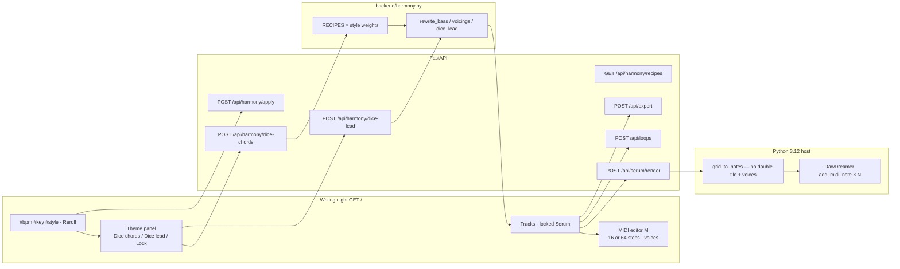
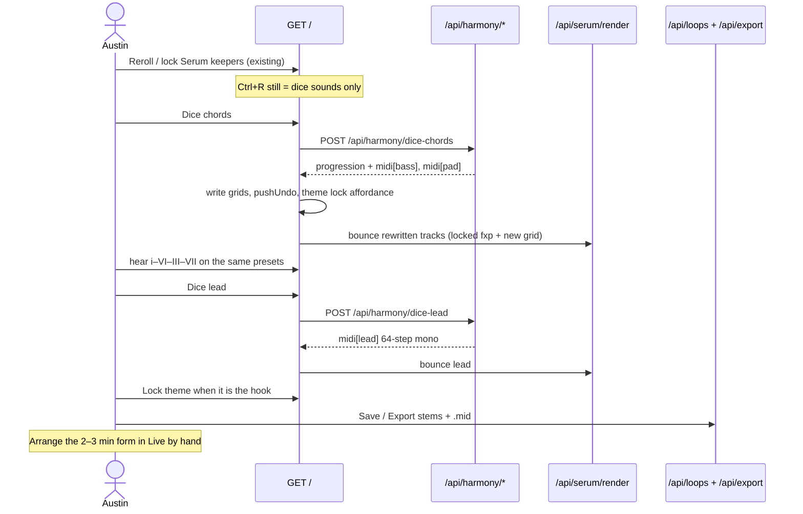

# Writing-night hook: progression + melody in Reroll

| Field | Value |
| --- | --- |
| **Status** | Draft |
| **Author** | Austin Russell |
| **Date** | 2026-08-12 |
| **App** | Reroll (`C:\Users\russe\desktop\reroll`) |
| **Surface** | Theme panel on `GET /` (`frontend/index.html` + `app.js`) — not `/harmony`, not `/arrange`, not a new repo |
| **Metric** | Time from “I have sounds” to “I have a theme I would carry for 2–3 minutes.” Target: **minutes**, not a DAW session. |

**Supersedes as next work:** [`docs/SUBTRACTIVE_ARRANGER.md`](C:\Users\russe\desktop\reroll\docs\SUBTRACTIVE_ARRANGER.md) is **deferred**. Do not implement `/arrange` in this project. Do not contradict that spec — this document is the writing-night successor, not a silent rewrite of arrangement night.

---

## Overview

Reroll already picks from the local Splice + Serum libraries, locks keepers, and bounces a 4-bar loop. The remaining writing-night failure is not “I cannot mute hats.” It is a 4-bar loop of *sounds* with no harmonic or melodic identity: a mute map of a static i-minor drone is still a drone.

This design adds a **session-level 4-bar chord progression** on the writing page. Dice it from a small genre recipe list (not a jazz generator). That object **rewrites bass MIDI (roots) and pad MIDI (voicings)** on the locked Serum presets so the hook is audible *with the sounds you kept*. A second dice writes a **monophonic lead over the current chord** (chord tones on the downbeat, passing tones off). Lock the theme the same way you lock a track. Arrange the 2–3 minute form in Ableton by hand.

v1 ships Phase 1 + enough of Phase 2 that a lead can be diced over the progression, plus persist/export. Phase 3 (macros / second-bar answer / resample-chop) and Suno-vocal → MIDI via Resampler are specified as later PRs. Suno audio never ships.

---

## Background & Motivation

### Current state

| Piece | Where | What it does today |
| --- | --- | --- |
| Session | `frontend/app.js` `state` (`trackOrder`, `slots`, `options`) | Dynamic tracks; lock / mute / solo / dice **sounds** |
| Loop length | `LOOP_BARS = 4` in `frontend/app.js` ~193 and `backend/timing.py` | Pinned by `tests/unit/test_timing.py::test_loop_bars_is_four`. **Do not change.** |
| MIDI grid | `frontend/midi.js` | **Monophonic** 16-step bar. Cell = `{ degree, length, vel } \| null`. `gridToNotes` **tiles** that bar `LOOP_BARS` times. |
| MIDI editor | `openMidiEditor` / `renderMidiEditor` / `commitMidiDraft` in `app.js` | Hard-coded **16 cells**. Subtitle: “Single-note pattern.” |
| JS fallback | `scheduleMidiAtStep` (`app.js` ~1579) | Reads `midiState.grid[step % 16]` — one oscillator via `scheduleSynthNote`. |
| Serum bounce | `renderOneSerumStem` → `POST /api/serum/render` | Payload: `{ bpm, bars: 4, key, octave, fxp, grid, macros? }`. Host `SerumSession.render_midi` already calls `add_midi_note` **per note** (polyphonic-capable). |
| Grid expand (Python) | `backend/midi_util.grid_to_notes`, **duplicate** `host/renderer.py::grid_to_notes` | Same tile rule: `for bar in bars: for cell in grid`. A 64-step grid + `bars=4` would emit **16 bars** of notes. |
| Generate / dice | `POST /api/generate`, `POST /api/reroll` | Picks assets. `doGenerate` **keeps** existing `slot.midi` (`app.js` ~3170–3181). Sounds and MIDI are already separate. |
| Undo | `captureDocSnapshot` / `restoreDocSnapshot` | 40-step stack of tracks + BPM/key/style. **No session-level harmony field.** |
| Save | `serializeLoop` ~4515 → `POST /api/loops` → `save_loop` ~1461 | `version: 1` document: `id, name, bpm, key, style, options, track_order, slots, saved_at`. Slot `midi` is `cloneMidi` (shallow cell copy). |
| Export | `doExportLoop` ~5301 → `POST /api/export` → `export_loop` | Sends per-track `midi.grid`. Writes stem WAV + `_midi.mid` via `grid_to_notes(..., bars=bars)`. |
| Keyboard on `/` | `app.js` ~4895–4930 | **Space** play/stop. **Ctrl+Z / Y** undo/redo. **Ctrl+R** `doGenerate` (block reload). |

Artist plan (`C:\Users\russe\desktop\edm-music-working\edm-music-plan.md`): the enemy is the 8-bar loop trap; nights are phase-separated (write / arrange / mix); AI is authorship-preserving only — **no Suno-style full-track generation**.

### Pain

Austin can already bring parts in and out in Live Arrangement view. Building `/arrange` next would optimize the wrong night. What writing night does not give him:

1. A **hook and theme** he would carry for 2–3 minutes.
2. **Sounds that evolve against that theme** (Phase 3), not a new mute map.
3. Chords he can **hear on the locked Serum preset**, not a piano-roll abstraction in another app.

Today every Serum bar is the same 16-step pattern in the session key. Bass is “root quarters” tiled four times — an i-minor drone with rhythm. Dice-sound keeps that MIDI. There is no progression object, no pad voicing, no lead-over-chords.

### Why `/arrange` is the wrong next bet

[`docs/SUBTRACTIVE_ARRANGER.md`](C:\Users\russe\desktop\reroll\docs\SUBTRACTIVE_ARRANGER.md) remains valid for **arrangement night**. It already records:

- Writing loop stays `LOOP_BARS = 4`; an 8-bar writing cycle is a later change.
- Resampler WAVs are just locked stems; no in-arranger chop.
- Target form is ~4 minutes of mute/carve, not a 6–7 minute DJ tool.

This project does **not** implement that page, its `reroll.session.v1` handoff, or `POST /api/arrange/*`. When arrangement night is built later, it consumes whatever MIDI this work wrote — a theme in the loop, not a drone.

---

## Goals & Non-Goals

### Goals (v1)

1. Session-level **4-bar** progression on the session **tonic**, diced from **≤ 8** genre recipes, always realized as **natural minor of that tonic** (a major `#key` does not flip the recipe into major-mode functions).
2. **Dice chords** rewrites bass MIDI (roots) and pad-like MIDI (3–4 note voicings) without changing Serum `path` / `macros`.
3. **Dice lead** writes a monophonic lead over the **current** progression (chord tones on downbeats, passing tones off).
4. **Lock** the progression with the same mental model as `state.slots[id].locked`.
5. Hear the result **with the locked Serum preset** (existing bounce + live refresh).
6. Persist through `serializeLoop` / `POST /api/loops` / `applyLoadedLoop` / Serum bounce / `POST /api/export` (stems + `.mid`).
7. Lives as a **panel on `/`**. Space / Ctrl+Z / Ctrl+R keep today’s meanings. Dice-chords / dice-lead do **not** regenerate sounds.
8. Local only. No cloud. No Suno-in-the-loop.

### Non-goals (v1)

- `/arrange`, mute maps, 8-bar writing `LOOP_BARS`, locators, `.als` arrangement clips.
- Jazz generator, secondary dominants, modal interchange beyond the recipe table, Roman-numeral editor.
- Changing `LOOP_BARS` or kick/hat pattern math.
- Shipping AI audio. Suno WAV as a playable track.
- New repo / `/harmony` page / Resampler process in-process for v1.
- Auto-adding a pad track; auto-dicing on Reroll.
- Phase 3 evolution (macro dice, second-bar answer as a first-class object, resample/chop UI) as a v1 blocker — macros already exist on Serum tracks.

---

## Key Decisions

| Decision | Choice | Rationale |
| --- | --- | --- |
| Where it lives | Theme panel on `/` between the session bar and the waveform | Product: writing night. Key/style already sit there. Not `/harmony`, not `/arrange`. |
| Next vs deferred | This is next. Arranger spec stays deferred and intact | Austin already arranges in Live. The 8-bar trap *for him* is no theme. |
| Loop length | Keep `LOOP_BARS = 4` | Pinned by `test_loop_bars_is_four`. 8-bar writing cycle is a later change (arranger doc already flags it). |
| Progression ownership | **Session-level** object `state.progression`, not a slot field | One theme. Bass + pad + lead all read it. Same lock/dice as tracks. |
| Recipe engine | Small weighted list (8), not a generator | Genre lanes are known (melodic techno / prog house / trance 3.0). Predictable, editable, testable. |
| Who expands MIDI | **Python `backend/harmony.py`** via HTTP. Client applies returned `midi` maps | Matches arranger’s “don’t duplicate the expander in JS.” pytest is the regression net. Three existing `grid_to_notes` copies already drift. |
| How bars differ | Dice **writes 64-step grids** (`4 × 16`) into bass/pad/lead | A 16-step grid tiled 4× cannot encode i–VI–III–VII. The editor must show what you hear. |
| Tile rule | If `len(grid) == bars * 16`, treat as **already expanded** — do not tile again | Today `grid_to_notes` / `MidiEngine.gridToNotes` / `host.renderer.grid_to_notes` all do `for bar in bars: for cell in grid`. 64×4 would become 16 bars and break bounce length vs notes. |
| Polyphony | Cell gains optional `voices: [{degree, oct, alter?}]`. Mono cell stays valid | Pads need 3–4 notes. Bass/lead stay one voice. Host `add_midi_note` is already per-note. |
| Track lock vs theme lock | Track lock = keep **preset**. Theme lock = keep **progression**. Dice-chords may rewrite locked tracks’ MIDI | That is the point: same Serum, new theme. `doGenerate` already keeps MIDI when dicing sounds. |
| Ctrl+R | Unchanged: reroll **sounds** only | Product constraint. New dice buttons do not regenerate library picks. |
| New shortcuts | **None in v1** | Do not steal Space / Ctrl+Z / Ctrl+R. Buttons on the Theme panel. |
| Auto-seed | No progression until first **Dice chords** | Reroll stays “sounds.” Theme is an explicit second gesture. |
| Sample tracks | Do **not** rewrite `bass_audio` / `lead_audio` / vocals | Those are audio. Key-tag transpose already exists in `midi_util.transpose_semitones_from_name`. |
| Realize vs `#key` quality | **Always Aeolian of the tonic.** `parse_key` quality is ignored. Session `F major` → realize as **F minor** (F/Db/Ab/Eb). `progression.key` and written `midi.key` are `"{tonic} minor"`. | All eight recipes are minor-roman. Literal major-mode i–VI–III–VII is Fmin/Dmaj/Amaj/Emaj — not the Afterlife/prog cycles. `#key` still picks the tonic. No major recipe table in v1. |
| Hear-it key | After a theme (or whenever `slot.midi.key` is set): bounce, JS scheduler, preview, editor `degreeToMidi`, and `rekeyAllMidi` use **`slotMidiKey(role)` = `slot.midi.key \|\| #key`**. Never send raw `#key` into `degree_to_midi` / `POST /api/serum/render` when that quality is major. **`ensureSlotMidi` sets `midi.key` from `#key` only when creating `createMidiState`.** It must not overwrite an existing `midi.key`. `rekeyAllMidi` / apply are the only writers of `midi.key` after create. | Today `ensureSlotMidi` (~2779) always does `midi.key = $("#key").value`. `bindSlotElement` (~4166) calls it on every Serum rebind. Undo/load: `cloneMidi` (correct `"F minor"`) → `bindSlotElement` → `ensureSlotMidi` → `"F major"` → bounce D. `rekeyAllMidi` ~2785 has the same stamp; that is already forbidden once a theme exists. |
| `V` in that Aeolian | **Major V** (harmonic-minor leading tone). `v` is minor | Prog-house `i–iv–VI–V` must cadence. Store `alter` on the raised third. |
| Pad 7ths | Triad default. Add a 7th only on `i_VI_III_VII` and `i_iv_VI_V` | 3–4 notes as specified; not a jazz stack. |
| Pad / lead octave | Dice **keeps** `HarmonyTrack.octave` (slot). New pads default to 3 via a real `defaultOctave("pad")` bump (today it is bass=2 else 4 — **no pad bump exists**). | Do not silently drop a user octave. Do not cite a bump that is not in the code until PR 3 adds it. |
| `cloneMidi` contract | Copy `patternId`, `octave`, `key`, `bars`, `source`, `locked`; deep-copy each cell (`degree`, `length`, `vel`, `alter`, `voices[]`) | Today `cloneMidi` is four fields + `{ ...c }`. Without this, save/load/undo/commit drop `source` and apply will not rewrite a diced lead. |
| Save merge | `None` / missing `progression` → **keep** previous on overwrite, omit key on new file. Dict → validate and store. **No explicit-null clear** in v1 | Pydantic maps omit and `null` both to `None`. No clear-theme control in v1. |
| Client before first 64-step write | Merge **PR1 → PR3 → PR2 → PR4**; PR 5 persist after PR 2. PR 2 is **not** independently mergeable onto today’s 16-step client. | `gridToNotes` tiles `grid.length`; `scheduleMidiAtStep` is `% 16`; editor is 16 cells; `cloneMidi` is shallow. Writing 64-step + `voices` first would desync romans vs grids. |
| Export | Existing stem + `.mid` path. Grids already rewritten. No extra mute-map files | Progression survives because MIDI survives. Manifest may echo `progression.recipe_id` for debug. |
| Phase 3 / Suno | Later PRs. v1 does not block on them | Macros already live on Serum tracks (`slot.macros`, M editor). Resampler stays a separate local tool. |

---

## Proposed Design

### Architecture



Same uvicorn process, same Serum worker (`_HOST_WORKER` in `backend/app.py`). No new host. No Resampler import in v1.

### User flow



### Time math (unchanged)

```text
LOOP_BARS          = 4          # do not change
STEPS_PER_BAR      = 16
cycle_steps()      = 64         # already true in timing.py
cycle_sec(128)     = 7.5 s
1 bar              = 16 sixteenths = 4 beats
progression.bars   = 4          # one chord per bar
```

An 8-bar cycle is **out of v1**. When `LOOP_BARS` later becomes 8, recipes grow to 8 chords (or 4+4 repeat) in a follow-up; the progression object already has `bars`.

### Theme panel (UX)

Insert `<section class="theme" id="theme-panel">` in `frontend/index.html` **between** `<section class="session">` and `<section class="wave-overview">`.

```text
Theme
  [ i  –  VI  –  III  –  VII ]     F minor · melodic techno
  [ 🔓 Lock ]   [ 🎲 Chords ]   [ 🎲 Lead ]
```

| Control | Behavior |
| --- | --- |
| Romans row | `— no theme —` until first dice. Then four cells, current-bar highlight while playing (`scheduler.nextStep / 16`). |
| **🎲 Chords** | `pushUndo("Dice chords")` → POST dice-chords → apply `progression` + returned MIDI → live Serum refresh on rewritten ids. Disabled when `progression.locked`. |
| **🎲 Lead** | Disabled until a progression exists, or when theme is locked *and* every lead track’s MIDI is also locked (v1: disabled only when no progression). Does not change chords. |
| **Lock** | Toggles `progression.locked`. Same padlock chrome as `.slot.locked`. Dice-chords no-ops when locked. |
| Status | `Theme · i–VI–III–VII · rewrote bass, pads · bouncing…` then existing yellow/green transport. |

No new global keybindings. Do not bind `C` / `L` / Ctrl+Shift+R.

Lead button enable: `Boolean(state.progression)` and at least one Serum track with `harmonyRole === "lead"` **or** user may still click and get `setStatus("Add a Serum lead — Lead / arp / pluck / …")`.

### Harmony roles

Map `baseType(id)` / `slots[id].type` (same split as `export_loop` `tid.split("__")[0]`):

| `type` | `harmony_role` | Dice chords | Dice lead |
| --- | --- | --- | --- |
| `bass` | `bass` | rewrite roots, keep rhythm | no |
| `pad`, `pads`, `strings`, `chorus`, `keys` | `pad` | rewrite 3–4 note voicings | no |
| `lead`, `synth`, `arp`, `pluck`, `seq`, `hoover`, `guitar`, `brass` | `lead` | no | rewrite mono phrase |
| `kick`, `hats`, `clap`, `perc`, `fx`, `vocal`, `lead_audio`, `bass_audio`, `snare`, `loop` | `none` | no | no |

`harmony_role(track_type) -> "bass" | "pad" | "lead" | None` lives in `backend/harmony.py` and is mirrored as a 15-line `harmonyRole(type)` in `frontend/harmony.js` (display + button enable only — **not** the expander).

### Progression object

Canonical session object (also the `progression` key on `saves/*.json`):

```json
{
  "version": 1,
  "bars": 4,
  "key": "F minor",
  "recipe_id": "i_VI_III_VII",
  "label": "i–VI–III–VII",
  "locked": false,
  "style_used": "Melodic Techno",
  "chords": [
    {
      "bar": 0,
      "roman": "i",
      "root_degree": 0,
      "quality": "min",
      "root_pc": 5,
      "pcs": [5, 8, 0],
      "intervals": [0, 3, 7],
      "alters": {}
    },
    {
      "bar": 1,
      "roman": "VI",
      "root_degree": 5,
      "quality": "maj",
      "root_pc": 1,
      "pcs": [1, 5, 8],
      "intervals": [0, 4, 7],
      "alters": {}
    },
    {
      "bar": 2,
      "roman": "III",
      "root_degree": 2,
      "quality": "maj",
      "root_pc": 8,
      "pcs": [8, 0, 3],
      "intervals": [0, 4, 7],
      "alters": {}
    },
    {
      "bar": 3,
      "roman": "VII",
      "root_degree": 6,
      "quality": "maj",
      "root_pc": 3,
      "pcs": [3, 7, 10],
      "intervals": [0, 4, 7],
      "alters": {}
    }
  ],
  "diced_at": "2026-08-12T23:10:00Z"
}
```

Notes:

- `root_pc` / `pcs` are absolute pitch classes 0–11 (`C=0`). F minor i = F, Ab, C = `[5, 8, 0]`.
- **Realize ignores session major/minor.** `realize(recipe, key)` takes only the tonic from `parse_key` and spells every roman in **natural minor of that tonic**. `realize("i_VI_III_VII", "F major")` === `realize("i_VI_III_VII", "F minor")` → roots F, Db, Ab, Eb. `progression.key` is always `"{tonic} minor"` (e.g. `"F minor"`).
- `root_degree` is 0–6 in that **Aeolian**, never in a major scale. Degree 5 in F is Db, not D. Written `midi.key` is the same `"{tonic} minor"` so `degree_to_midi` cannot silently major-ize VI.
- `alters` maps scale-degree string → semitone offset. For recipe `i_iv_VI_V` bar 3: roman `V`, `root_pc=0` (C), `pcs=[0, 4, 7]` (C–**E**–G), `alters={"6": 1}` because Aeolian degree 6 is Eb.
- Human-readable romans stay on the object so Austin can edit JSON if he wants.
- `bars` is always 4 in v1. Validator rejects other lengths.
- Theme subtitle when `#key` is major: `F Aeolian (session F major)` so the `#key` list’s A/C/F/G major options are not a surprise.

### Recipes (v1, all 4 bars)

Keep this table in `backend/harmony.py` as `RECIPES`. Editing it does not change the save schema.

| `id` | Romans | Lane bias | Notes |
| --- | --- | --- | --- |
| `i_VI_III_VII` | i–VI–III–VII | Melodic techno, Trance 3.0 | Afterlife / Anjuna anthem. Pad may add b7. |
| `i_VII_VI_VII` | i–VII–VI–VII | Melodic techno | Two-bar lift, common techno bed. |
| `pedal_i` | i–i–i–i | Peak / harder techno | Not a “mute map of a drone” if a lead exists; bass stays tonic on purpose. |
| `i_iv_VI_V` | i–iv–VI–V | Prog house | **V is major** (leading tone). Pad may add 7th. |
| `i_VI_iv_V` | i–VI–iv–V | Trance / prog | Cadential V major. |
| `i_III_VI_VII` | i–III–VI–VII | Trance lift | Relative-major color. |
| `i_v_VI_VII` | i–v–VI–VII | Darker techno | **v is minor** (no leading tone). |
| `i_VI_i_VII` | i–VI–i–VII | Call / response | Two 2-bar cells. |

**No more than these eight.** No I–V–vi–IV, no ii–V–I. No parallel major-recipe table. A session in F major still plays these **F Aeolian** cycles.

Style weights (soft, same spirit as `generate.py` `_STYLE_SYNONYMS` / `style_tokens`):

| Style tokens (from `#style`) | Weight boost |
| --- | --- |
| `melodic`, `afterlife`, `melodic techno` | `i_VI_III_VII` ×3, `i_VII_VI_VII` ×2, `i_III_VI_VII` ×2 |
| `prog`, `progressive`, `anjunadeep`, `prog house` | `i_iv_VI_V` ×3, `i_VI_iv_V` ×2 |
| `trance`, `uplifting`, `anjunabeats`, `3.0` | `i_VI_III_VII` ×3, `i_VI_iv_V` ×2, `i_III_VI_VII` ×2 |
| `techno`, `peak`, `hard` (and not `melodic`) | `pedal_i` ×2, `i_VII_VI_VII` ×2, `i_v_VI_VII` ×2 |
| `house` (and not `prog`) | `i_iv_VI_V` ×2, `i_VI_i_VII` ×2 |
| empty / `No preference` | uniform |

`pick_recipe(style, avoid_id)` never returns `avoid_id` if another recipe exists (re-dice feels like a new idea).

Roman → quality (fixed):

```text
i, ii, iv, v     → min
ii°, iio         → dim   (not used in v1 recipes)
III, VI, VII, I, V → maj
```

### MIDI grid contract (the main code gap)

#### Today

```text
midi = {
  patternId: "root-quarters",
  octave: 2,
  key: "F minor",
  grid: [ {degree, length, vel} | null ] × 16,
  locked: false   // unused
}
```

`gridToNotes(grid, key, octave, bars=4)` tiles 16 → 64 steps. `scheduleMidiAtStep` uses `step % 16`. Editor renders 16 buttons.

#### After v1

```text
midi = {
  patternId: "prog-roots" | "prog-voicing" | "prog-lead" | existing ids | "custom",
  octave: number,
  key: "F minor",
  bars: 1 | 4,              // 1 = legacy 16-step tile; 4 = full-loop grid
  grid: Cell × (16 | 64),
  source: "progression" | "user" | "pattern"
}

Cell =
  null
  | { degree, length, vel, alter?: number }
  | { degree, length, vel, alter?: number,
      voices: [ { degree, oct?: number, alter?: number, vel?: number } ] }
```

Rules:

1. If `voices` is a non-empty array, emit **one note per voice**. `degree` / `vel` on the cell remain the primary (used by mono editor + summary).
2. If `voices` is absent, emit the single `degree` (+ `alter`) as today. **Old saves keep working.**
3. `alter` is semitones added after `degree_to_midi` (needed for V’s E natural in F Aeolian). Default 0.
4. `oct` on a voice is an absolute MIDI octave override; default = **that slot’s** `midi.octave`. There is **no** pad bump in today’s `defaultOctave` (`role === "bass" ? 2 : 4`). PR 3 adds `defaultOctave("pad"|"pads"|"strings"|"chorus"|"keys") → 3` so **new** pad tracks start at 3. Dice-chords / dice-lead **pass `HarmonyTrack.octave` through** and must not overwrite a user-set octave.
5. `place()` stays monophonic (clears overlaps, writes one degree, deletes `voices`). Use it only on **bass/lead** (or cells without `voices`). New `placeVoices(grid, step, voices, length, vel)` for pad apply.
6. **Pad editor must not call `place()`.** If `harmonyRole(type)==="pad"` **or** the cell has `voices`, a click **cycles inversion** (rotate `voices`: move the bottom note up an octave) and keeps the triad. Empty pad cell + progression → `placeVoices` of that bar’s voicing. Shift+click may cycle the top voice’s `degree` only. Bass/lead keep today’s click-to-place / click-to-clear.
7. **`cloneMidi` (single contract — `app.js`)** — used by `serializeLoop`, `captureDocSnapshot`, `restoreDocSnapshot`, `applyLoadedLoop`, `commitMidiDraft`, `openMidiEditor` draft, `doExportLoop`, and harmony apply:

```javascript
function cloneMidi(midi) {
  if (!midi || typeof midi !== "object") return null;
  return {
    patternId: midi.patternId || "custom",
    octave: midi.octave ?? 3,
    key: midi.key || null,
    bars: midi.bars === 4 || (Array.isArray(midi.grid) && midi.grid.length === 64) ? 4 : 1,
    source: midi.source || "pattern",
    locked: Boolean(midi.locked),
    grid: Array.isArray(midi.grid)
      ? midi.grid.map((c) => {
          if (!c || typeof c !== "object") return null;
          const cell = {
            degree: c.degree,
            length: c.length,
            vel: c.vel,
          };
          if (c.alter) cell.alter = c.alter;
          if (Array.isArray(c.voices) && c.voices.length) {
            cell.voices = c.voices.map((v) => ({ ...v }));
          }
          return cell;
        })
      : null,
  };
}
```

`commitMidiDraft` writes **those same fields** from `ed.draft` (including `bars` / `source` / `locked`). A 16-step pattern pick on a 64-step draft must **not** assign `grid = buildPatternGrid(...)` (length 16). Tile the new 16-step rhythm into each bar and keep `bars: 4`. Clear empties all 64 cells and keeps length 64.

**User mutation → `source: "user"`.** Any hand edit sets `draft.source = "user"` (and `patternId: "custom"` as today) **before** `commitMidiDraft`: `place()`, pad inversion cycle, Shift+click degree, length drag, pattern tile, Clear. Dice-chords / dice-lead / apply set `source: "progression"` again. Key-change apply **rewrites lead only if `source === "progression"`**, so a click in M must flip the flag or apply will regenerate the line. Degrees on a `"user"` track still play in `midi.key` (Aeolian); they are not wiped. Dice-lead may overwrite again.

#### `grid_to_notes` tile rule (implement once, three call sites)

```python
# backend/midi_util.py — canonical
STEPS_PER_BAR = 16

def expand_bars(grid: list, bars: int) -> int:
    n = len(grid) or 16
    if n == int(bars) * STEPS_PER_BAR:
        return 1  # already a full-loop grid
    return max(1, int(bars))

def cell_voices(cell: dict) -> list[dict]:
    if isinstance(cell.get("voices"), list) and cell["voices"]:
        return cell["voices"]
    return [{"degree": cell.get("degree", 0),
             "alter": cell.get("alter", 0),
             "vel": cell.get("vel", 100)}]
```

Then the existing `for bar in range(expand_bars(...)): for s, cell in enumerate(grid)` loop emits **one event per voice**. `host/renderer.py::grid_to_notes` becomes a thin wrapper around `backend.midi_util.grid_to_notes` (host already inserts project root on `sys.path`). `frontend/midi.js::gridToNotes` gets the same `expand_bars` + `voices` behavior. Keep `tests/unit/test_grid_to_notes.py` importing from `host.renderer` so the host path cannot drift.

`write_midi_file` already sorts overlapping note-on/off — poly `.mid` works with no change.

#### Scheduler / editor / bounce

| Site | Change |
| --- | --- |
| `slotMidiKey(role)` | **Required helper.** `return state.slots[role]?.midi?.key \|\| $("#key")?.value \|\| "F minor"`. After dice this is `"F minor"` even when `#key` is `"F major"`. |
| `ensureSlotMidi(role)` | **Create only.** If `!slot.midi`, `createMidiState(harmonyRole, #key)` (no theme yet — session label is fine). **If `slot.midi` already exists, return it unchanged — do not assign `midi.key = #key`.** Today’s `else { midi.key = key }` branch is deleted in PR 3. `bindSlotElement` / undo / load go through this path. |
| `scheduleMidiAtStep` | `const n = midiState.grid.length; const idx = step % n;` If `voices`, `scheduleSynthNote` each. **`degreeToMidi(slotMidiKey(role), …)` — not `#key`.** |
| `scheduleMidiPreviewBar` | Pass `midi.bars \|\| (grid.length > 16 ? 4 : 1)`. **`gridToNotes(..., slotMidiKey(role), …)`.** |
| `renderMidiEditor` | If `grid.length > 16`: **bar pager** (1–4) showing 16 cells of that bar, plus a 4-cell roman strip. Pad cells list stacked note names (`F3·Ab3·C4`). Subtitle: drop “Single-note” for `harmonyRole==pad` → “Voicing · 4 bars · F minor”. Pad click = inversion cycle, never `place()`. Display / `degreeToMidi` use `draft.key \|\| slotMidiKey(role)`. **Do not assign `$("#key").value` onto `draft.key` when `source` is `progression` or `user`.** User edits call `markMidiUser(role)` (`source: "user"`). |
| `renderOneSerumStem` | Sends `grid` + `bars: scheduler.bars` (4) + **`key: slotMidiKey(role)`** (not `$("#key").value`). After the tile fix, host expands 64-step grids once. Cache key already hashes `notes` (`host/renderer.py` v5) — new themes miss cache (correct). |
| `export_loop` | Same `grid` + `bars`. Already prefers `midi_state["key"]`. `.mid` becomes a true 4-bar phrase. |
| Waveform MIDI lane | Already `midi.key \|\| #key` (~1435). Keep that; do not “fix” it back to `#key`. Same tile fix so peaks match audio. |

### Dice chords — rewrite rules

Input: session `key`, `style`, current `progression.recipe_id` (avoid), tracks with `{id, type, midi, octave}`.

1. `recipe = pick_recipe(style, avoid=current_id)`.
2. `progression = realize(recipe, key)` — tonic from `key`, **always Aeolian** (fill `pcs`, `alters`, `label`, `progression.key = "{tonic} minor"`).
3. For each bass-role track:
   - Rhythm source = existing `midi.grid` if it is length 16 or 64; else `buildPatternGrid("root-quarters")`.
   - Collapse 64 → 16 by taking bar 0 (rhythm only).
   - For `bar in 0..3`: copy the 16-step rhythm into `grid[bar*16 + s]`, set `degree = chord.root_degree`, clear `voices`, keep `length`/`vel`.
   - `patternId = "prog-roots"`, `bars = 4`, `source = "progression"`, `key = progression.key`.
   - **Octave unchanged** — `midi.octave = track.octave` (or existing `midi.octave`, else 2).
4. For each pad-role track:
   - `oct = track.octave` if set, else existing `midi.octave`, else **3**.
   - `voicing = voice_lead(progression.chords, start_octave=oct)` — close triad (or tetrad on the two recipes above), pick inversion that **minimizes top-note motion** from the previous bar (common-tone lock when possible).
   - 64-step grid: at `bar*16` place `placeVoices(..., voices, length=16, vel=90)`. Other steps null.
   - `patternId = "prog-voicing"`, `bars = 4`, `source = "progression"`, `key = progression.key`, `octave = oct`.
5. Lead-role MIDI is **not** touched by dice-chords (old lead against new chords is a later “re-dice lead” click).
6. Return `{ progression, midi: { id: midiState } }`.

Bass stays **roots only** (no inversions). That is the techno/trance/prog convention.

### Dice lead — rewrite rules

Requires a progression. If missing → 400.

Monophonic. 64-step grid. `patternId = "prog-lead"`, `source = "progression"`, `bars = 4`, `key = progression.key`.

**Per lead track:** `dice_lead_grid(progression, key, *, seed, octave)` — call once per id so two leads at octaves 4 and 5 stay put. `octave` comes from `HarmonyTrack.octave` / existing `midi.octave` (default 4).

Per bar, using that bar’s `pcs` + **Aeolian of the tonic** (not the major scale if `#key` says major):

```text
rhythm = pick one of: sparse (quarters), 8ths, techno-gallop
         (reuse PATTERN_LIBRARY hit times; do not invent jazz syncopation)

for each 16th s in 0..15:
  if no hit in rhythm: rest
  elif s % 4 == 0:          # downbeat / quarter
      pitch = chord tone (pc in chord.pcs)
      prefer root on s==0; else 3rd or 5th ≠ previous pitch
      length 2–4
  elif s % 2 == 0:          # 8th offbeat
      with 0.65: passing scale degree (neighbor of last pitch, in key)
      else: chord tone
      length 1–2
  else:                     # 16th
      with 0.25: passing tone, length 1
      else: rest
```

Constraints:

- Pitches are **Aeolian** degrees of the tonic, plus `alter` only when the downbeat **is** the raised 3rd of a major V.
- Range: a 9th centered on `degree_to_midi(progression.key, 0, octave)` (octave 4 → MIDI 60–74; octave 5 → 72–86; octave 3 → 48–62). If `octave` is omitted, default 4.
- No consecutive leaps > 7 semitones except into bar 0.
- `avoid` the previous lead grid’s first four downbeat PCs when possible so re-dice is audible.

Optional later (Phase 3, not v1): force bars 1+3 = call, bars 2+4 = answer (same rhythm, contour inversion).

### Key change

`#key` already calls `rekeyAllMidi()` (`app.js` ~2785) which today does `slot.midi.key = $("#key").value` and live-bounces. **That assignment is forbidden once a theme exists** — it would stamp `"F major"` onto a grid whose degrees are Aeolian and bounce D instead of Db.

```text
rekeyAllMidi():
  if (state.progression) {
    POST /api/harmony/apply { key: #key, progression, tracks }
    → tonic from new #key, realize same recipe as Aeolian of that tonic
    → rewrite bass/pad always
    → rewrite lead only if midi.source === "progression"
    apply returned midi (includes midi.key = "{newTonic} minor")
    for tracks not in the response (source === "user"):
      keep the grid
      set midi.key = tonicMinorLabel(#key)   // transpose degrees; do not regenerate
      do NOT set midi.key = raw #key
    live-bounce rewritten + rekeyed ids via slotMidiKey
  } else {
    // no theme: today's behavior, session label as-is (may be major)
    for each slot.midi: midi.key = #key
  }
```

Do **not** pick a new recipe on key change. Same romans, new pcs. `midi.source` **must** have survived `cloneMidi` / save / `commitMidiDraft`, and user edits must have flipped it to `"user"`, or apply will wipe a hand-edited lead.

Style change does **not** auto-dice.

### Undo / persist / load

`captureDocSnapshot` (`app.js` ~4349) adds:

```javascript
progression: cloneProgression(state.progression),
```

`restoreDocSnapshot` / `applyLoadedLoop` restore it and call `renderThemePanel()`. **PR 3 ships `function renderThemePanel() {}`** (empty stub) so that call cannot `ReferenceError` on undo before PR 2 replaces the stub with the real panel paint.

Both restore paths rebuild the stack via `buildSlotElement` → `bindSlotElement` → `ensureSlotMidi`. That is why `ensureSlotMidi` must **not** overwrite `midi.key`: `cloneMidi` already restored `"{tonic} minor"`. If the old `else` branch stays, Ctrl+Z / load restamp `"F major"` and the next bounce plays D.

`serializeLoop` adds `progression: cloneProgression(state.progression)` (omit the key if there is no theme). Slot `midi` goes through **`cloneMidi`** (full contract above).

`SaveLoopRequest` + `save_loop` (v1 — **no explicit-null clear**):

- Request field is `progression: dict[str, Any] | None = None`.
- FastAPI/Pydantic maps both omit and JSON `null` to `None`. Do **not** treat `None` as “wipe the theme.”
- **Overwrite + `None` / missing** → keep the previous `progression` key, then `reconcile_progression` (force `bars=4`; respell if save `key` tonic changed).
- **Overwrite + dict** → validate and store.
- **New file + `None`** → omit the key.
- No “clear theme” control in v1, so `model_fields_set` is unnecessary. If a later PR adds Clear, then require `"progression" in body.model_fields_set` and allow a real JSON `null`.

`_loop_summary` gains `"has_progression": bool` so My Loops can badge “has theme.”

`applyLoadedLoop` already ignores unknown keys — old documents without `progression` load as today (`— no theme —`). Loaded `midi` must go through `cloneMidi` so `bars` / `source` / `voices` survive.

Persist test (PR 5): round-trip `source: "progression"` and `bars: 4` on a lead slot; `POST /api/harmony/apply` with a new tonic still rewrites that lead.

### Live hear-it path

After applying returned MIDI:

```javascript
for (const id of rewrittenIds) {
  state.slots[id].midi = cloneMidi(midi[id]);
  applySlot(id, { ...state.slots[id] });
  if (midiEditors[id]) {
    midiEditors[id].draft = { ...midiEditors[id].draft, ...cloneMidi(midi[id]) };
    renderMidiEditor(id);
  }
  if (isPlaying) refreshPlayingTrack(id, { keepOldUntilReady: true });
}
```

This is the same path as `commitMidiDraft` / `doReroll` live update. Locked `path` + new `grid` → new sha1 → new bounce. **`renderOneSerumStem` / JS fallback must use `slotMidiKey(id)`** so an F major session still bounces bass VI as **Db**, not D. Status bar yellow via existing `beginTransportBusy`. Dice HTTP itself is not marked busy (target &lt; 50 ms).

PR 2 checklist (manual or host test): session `#key = F major`, dice `i_VI_III_VII`, bass `source: "progression"` → bounced / `grid_to_notes` MIDI for bar-1 root is Db (MIDI 49 at octave 2), **not** D (50).

### Phase 3 — evolution inside the loop (sketch, not v1)

Once a hook exists, the 2–3 minute track is **that idea repeating with variation**, not a 16-block mute map.

| Idea | How it fits existing code | When |
| --- | --- | --- |
| Serum macro motion | `slot.macros` already saved/exported; M editor sliders; host applies 4–8 knobs. Add “dice macros” that random-walk unlocked knobs on locked presets. Note: `serum_render` currently slices `macros[:4]` (`app.js` payload sends 8; `app.py` ~950 keeps 4) — fix to 8 when touching macros. | PR after v1 |
| Second-bar answer | Lead generator flag `call_response: true` (bars 0/2 call, 1/3 contour invert). No new object. | Cheap follow on dice-lead |
| Resample / chop the lead | Bounce the Serum lead (already a 4-bar WAV in `host/cache`). Drop into Resampler (`C:\Users\russe\desktop\resampler`) Inspire, bounce a chopped WAV onto a `lead_audio` track. Reroll does not import Resampler. | Manual in v1; optional later button “Open in Resampler” |
| 8-bar writing cycle | Change `LOOP_BARS` + recipes of 8. Arranger already tiles `8 // LOOP_BARS`. Separate project. | After this ships |

### Phase 2 optional — Suno vocal → MIDI (later PR, not v1)

Authorship-preserving extraction only:

```text
User drops a local WAV (Suno export they made elsewhere)
  → Resampler detect_notes() (resample/notes.py, pYIN)
  → list[{start, end, midi, pc}]
  → quantize to 16ths @ session BPM
  → snap each note to nearest chord.pcs of that bar (or scale passing if off-beat)
  → write 64-step mono grid onto the Serum lead
Suno / source WAV is never set as slot.path, never exported as a stem.
```

Resampler already returns `{notes, unique, count}` from `detect_notes`. Reroll would either shell `resample` or copy the ~90-line function — **do not vendor Suno, do not call a cloud API.** v1 has no drop target.

---

## API / Interface Changes

All local, no auth. New routes next to existing explicit file routes in `backend/app.py`.

### `GET /api/harmony/recipes`

```json
{
  "ok": true,
  "loop_bars": 4,
  "recipes": [
    {
      "id": "i_VI_III_VII",
      "label": "i–VI–III–VII",
      "romans": ["i", "VI", "III", "VII"],
      "lanes": ["melodic techno", "trance"],
      "pad_seventh": true
    }
  ]
}
```

UI does not have to render a picker in v1 (dice is enough). Endpoint exists so the panel can show the recipe name and tests can lock the list at 8.

### `POST /api/harmony/dice-chords`

```python
class HarmonyTrack(BaseModel):
    id: str
    type: str
    midi: dict[str, Any] | None = None
    octave: int | None = None

class DiceChordsRequest(BaseModel):
    key: str = "F minor"
    style: str = ""
    avoid_recipe_id: str | None = None
    locked: bool = False          # client copy of progression.locked
    tracks: list[HarmonyTrack]
```

- If `locked` → **409** `{ "detail": "theme locked" }`.
- Response: `{ "ok": true, "progression": {…}, "midi": { "<id>": midiState } }`.
- `midi` contains only bass/pad ids that were rewritten. Missing roles → empty map, progression still created.

### `POST /api/harmony/dice-lead`

```python
class DiceLeadRequest(BaseModel):
    key: str = "F minor"
    style: str = ""
    progression: dict[str, Any]
    tracks: list[HarmonyTrack]
    seed: int | None = None
```

- No progression / `bars != 4` → **400**.
- Rewrites every `harmony_role==lead` track in `tracks`, calling `dice_lead_grid(..., octave=track.octave)` **once per track**. If none, `{ midi: {} }` and the client status-lines.
- Does not modify `progression`.

### `POST /api/harmony/apply`

Respell + rewrite after a key change (or after a future recipe-table edit). Body: `{ key, progression, tracks }`. Tonic from `key`, **still Aeolian**. Returns the same shape as dice-chords but **keeps** `recipe_id` / `locked`. Rewrites lead MIDI only when `tracks[].midi.source == "progression"`.

### Save / export

```python
class SaveLoopRequest(BaseModel):
    # existing fields…
    progression: dict[str, Any] | None = None
```

`save_loop` merge (same rule as [Undo / persist / load](#undo--persist--load)):

- `None` / missing + existing file → keep previous `progression`, then `reconcile_progression`.
- dict → store after validate (unknown `recipe_id` allowed if `chords` is length 4 — user JSON edits).
- New file + `None` → omit key.
- Do **not** drop a theme on JSON `null`. There is no clear-theme action in v1.

`ExportRequest` unchanged. `doExportLoop` must send **`cloneMidi(s.midi)`** (not a four-field hand-roll) so `bars`, `source`, `alter`, and `voices` reach `export_loop` / `.mid`. Optional: add `progression` onto `manifest.json` if the client includes it — **not required for v1** if grids are correct.

`SerumRenderRequest.grid` stays `list[dict | None]`. Voices live inside the dict; Pydantic `Any` already allows it.

### Frontend surface area

| File | Change | Lands in |
| --- | --- | --- |
| `frontend/midi.js` | `voices`, `alter`, `expand_bars`, `placeVoices`, `gridToNotes`, `defaultOctave` pad=3, `midiSummary` for 64-step | **PR 3** (before any 64-step write) |
| `frontend/app.js` | Full `cloneMidi`; `slotMidiKey`; `markMidiUser`; `renderThemePanel()` **stub**; `scheduleMidiAtStep` `% grid.length` + `slotMidiKey`; editor pager; pad click = inversion; pattern/clear must not shrink 64-step grids; `captureDocSnapshot` / restore includes `progression` and calls the stub; `ensureSlotMidi` uses `harmonyRole` **and never overwrites existing `midi.key`** | **PR 3** |
| `frontend/index.html` | Theme `<section>`; bump `midi.js?v=` (`loop-4bars` → `hook-v1`) | **PR 2** |
| `frontend/app.js` | `state.progression` live object, Theme handlers, `rekeyAllMidi` → apply, live bounce after dice | **PR 2** (undo snapshot already in PR 3) |
| `frontend/harmony.js` | **Display-only**: `harmonyRole`, `formatRomans`. Do not reimplement dice. | PR 2 (tiny helper may land in PR 3 for `defaultOctave` / editor) |
| `frontend/styles.css` | Compact Theme row; bar highlight; pad cell stacked names. | PR 3 (editor) + PR 2 (panel) |
| `frontend/app.js` | `serializeLoop` / `applyLoadedLoop` progression key | **PR 5** |

---

## Data Model Changes

### Save JSON today → after

Today (`serializeLoop` + `save_loop`):

```json
{
  "id": "no-preference-f-minor-140bpm-ab12cd34",
  "name": "No preference · F minor · 140bpm",
  "bpm": 140,
  "key": "F minor",
  "style": "No preference",
  "options": { "filterRisers": true, "serum1": true, "serum2": true, "instruments": {} },
  "track_order": ["kick", "hats", "clap", "lead_audio", "bass"],
  "slots": {
    "bass": {
      "type": "bass",
      "path": "C:\\Users\\russe\\Documents\\Xfer\\…",
      "kind": "serum",
      "locked": true,
      "midi": {
        "patternId": "root-quarters",
        "octave": 2,
        "key": "F minor",
        "bars": 1,
        "source": "pattern",
        "locked": false,
        "grid": [ {"degree": 0, "length": 4, "vel": 100}, null, null, null, "…" ]
      },
      "macros": null
    }
  },
  "saved_at": "2026-08-12T23:00:00Z",
  "version": 1
}
```

After v1, same document plus:

```json
"progression": { "version": 1, "bars": 4, "recipe_id": "i_VI_III_VII", "locked": true, "chords": [ "…" ] }
```

and bass/pad/lead `midi` with `bars: 4`, `source: "progression"`, `grid` length 64, pad cells with `voices` (and `alter` when needed). `cloneMidi` must persist all of those fields — not only `patternId` / `octave` / `key` / `grid`.

`backend/persist.py` is **library.db only** — do not touch it.

### Export folder

Unchanged layout (`exports/<stamp>_<slug>/`). Serum stems are still `timing.cycle_sec(bpm, 4)` long. `.mid` files become **harmonically unique across the 4 bars** (16 bass notes of changing roots for root-quarters, 4 pad blocks, ~8–24 lead notes). `ABLETON_DROP/` and User Library mirrors unchanged.

### Migration

No migration job. Missing `progression` → empty theme. 16-step grids → keep tiling. First dice-chords overwrites bass/pad MIDI (undo-able).

---

## Alternatives Considered

### A. Build `/arrange` first (subtractive mute map)

Specified in `docs/SUBTRACTIVE_ARRANGER.md`.

- **Pros:** Matches the artist-plan arrangement-night ritual; 15-minute form metric.
- **Cons:** Austin already mutes in Live. A mute map of a drone is still a drone. Product decision: **rejected as next work.** Spec remains deferred, not deleted.

### B. Keep 16-step grids; apply chord-of-bar only at `gridToNotes` time

Bass `degree=0` means “root of current bar’s chord.”

- **Pros:** No editor pager; no tile-rule change.
- **Cons:** Opening M still shows one bar of “root quarters.” User cannot see i vs VI. Export/host must all receive the progression object or they disagree. **Rejected** for the written MIDI; progression is source of truth, but dice **materializes** 64-step grids so bounce/export/editor share one artifact.

### C. Full piano-roll (N rows × 64)

- **Pros:** Arbitrary polyphony, classic DAW feel.
- **Cons:** Large UI on a writing-night page whose editor is a 16-cell strip. Pads only need 3–4 stacked tones. **Rejected for v1.** `voices` on a cell is enough.

### D. Client-only theory in `midi.js` (no HTTP)

- **Pros:** Zero latency; no new routes.
- **Cons:** Fourth copy of theory next to `midi_util`, `host.renderer`, `resampler/theory.py`. pytest cannot lock recipes. Arranger already chose “Python expands.” **Rejected.**

### E. Jazz / ML chord generator

- **Pros:** Variety.
- **Cons:** Product: “not a jazz generator.” These lanes live on 4–5 stock cycles. Eight recipes are enough to dice in seconds.

---

## Security & Privacy Considerations

Same localhost threat model as today.

| Threat | Mitigation |
| --- | --- |
| Dice endpoints accept arbitrary grids | They only **return** new grids. They do not read disk. |
| Huge grids / DoS | Reject `len(chords) != 4`, `len(tracks) > 32`, grid length not in `{16, 64}`. |
| Path leakage | Harmony routes do not take `fxp` paths. Bounce still goes through `_assert_fxp_allowed`. |
| Suno / cloud | No network calls. Vocal import (later) is a local WAV → notes. Source audio never becomes an export stem. |
| `saves/*.json` absolute paths | Already true. No new network. |

No new auth. No uploads in v1.

---

## Observability

No metrics backend (keep it that way).

| Signal | How |
| --- | --- |
| Status bar | Existing grey / green / yellow. Yellow only during Serum bounce after dice, via `beginTransportBusy`. |
| Footer | `setStatus("Theme · i–VI–III–VII · bass+pad · live")` |
| Console | `console.info` on apply: recipe id + rewritten track ids (same style as Serum `fxp_loaded=` logs). |
| Export manifest | Optional `recipe_id` if we add it; otherwise `.mid` note counts already in `files[].notes`. |
| Tests | `pytest tests/unit -q` — recipes, F-minor pcs, **F major === F minor pcs**, V leading tone, no-double-tile, voices, locked 409, lead octave 9th, persist `source`/`bars`. PR 2 hear-it: F major session → bar-1 bass root **Db**. |

Success metric (manual): Austin times one session from locked sounds → a theme he would carry 2–3 minutes. If that is still a DAW-length job, v1 failed.

---

## Rollout Plan

Single user, no flag service.

1. Land **PR1 → PR3 → PR2 → PR4**, then PR 5. Theme panel (PR 2) must not merge until the JS 64-step contract (PR 3) is on main. Lead button disabled until a progression exists.
2. First real use: lock a bass + pad (or bass only) → Dice chords on Melodic Techno / F minor → confirm bounce is not a drone → Dice lead → Lock theme → Export → drop stems in Live and loop 2–3 minutes by hand.
3. **Rollback:** hide `#theme-panel`, revert `serializeLoop` progression field (old UI already ignores it). Saves with `progression` remain valid. No DB migration.
4. Kill switch if wanted: `REROLL_HARMONY=0` hides routes + panel. Not required.

No staged cohort. `.als` checkbox on the writing page is untouched.

---

## Risks

| Risk | Severity | Mitigation |
| --- | --- | --- |
| 64-step grid + `bars=4` double-tiles → 16 bars of MIDI, bounce still 4 bars, notes wrap/clash | **High** | Python tile fix in PR 1. **JS `expand_bars` + `% grid.length` + pager + full `cloneMidi` in PR 3, merged before PR 2 writes any 64-step grid.** Test: `len(grid)==64, bars=4` → last `start_beat` &lt; 16. |
| Three `grid_to_notes` copies drift (already documented in `host/renderer.py` “needs midi.js logic in Python”) | **High** | Host imports `backend.midi_util.grid_to_notes`. JS contract tested by golden vectors in pytest (pcs / beat times) plus a small `tests/unit/test_harmony.py`. |
| Pad polyphony inaudible (unison preset / mono legato) | **Med** | Still write 3–4 notes; many pads are polyphonic. Status hint if peak barely rises vs mono. User can dice the preset. Host already schedules overlapping notes. |
| JS fallback `scheduleMidiAtStep` still `% 16` after 64-step write → wrong chord until bounce returns | **Med** | Fixed in PR 3 **before** dice-chords. Provisional JS during bounce must play the 4-bar grid. |
| Dice-chords overwrites a hand-edited bass line the user liked | **Med** | Undo (`pushUndo` before apply). Theme lock after it feels right. Track lock does **not** freeze MIDI (documented on the Lock tip). |
| No pad track in the default stack (`INSTRUMENT_DEFS` pads `defaultOn: false`) | **Low** | Bass rewrite alone is a theme. Status: “Add a Pad track to hear voicings.” Do not auto-add. |
| `cloneMidi` drops `bars` / `source` / `voices` → undo, save, or M-commit desyncs apply | **High** | Full `cloneMidi` contract in PR 3. Persist test in PR 5: `source: "progression"` + `bars: 4` round-trip, then `apply` still rewrites that lead. |
| Merging Theme panel (PR 2) onto today’s 16-step client | **High** | Hard merge order: PR 3 before PR 2. PR 2 is not independently mergeable. |
| Session `F major` realized as Fmaj i–VI–III–VII (Fmin/D/A/E) | **High** | `realize` always Aeolian of the tonic. Test: `"F major"` pcs === `"F minor"` pcs. |
| Realize writes Db but bounce/JS still use `#key` → hear D | **High** | `slotMidiKey` on `renderOneSerumStem`, `scheduleMidiAtStep`, preview, editor. `rekeyAllMidi` never assigns raw `#key`. `ensureSlotMidi` never overwrites existing `midi.key`. PR 2 checklist: F major session → bass VI MIDI is Db. Undo/load must still bounce Db. |
| Undo/load rebind stamps `#key` via `ensureSlotMidi` | **High** | PR 3: delete the `else { midi.key = #key }` branch. Only `createMidiState` sets key. `rekeyAllMidi` / apply remain the only later writers. |
| Clicking a diced pad cell collapses the triad | **Med** | PR 3: pad / `voices` click cycles inversion; never `place()`. |
| Hand-edited lead stays `source: "progression"` → key change regenerates it | **Med** | `markMidiUser` on every editor mutation. Apply skips `source === "user"`. |
| PR 3 undo calls `renderThemePanel()` before PR 2 | **Med** | PR 3 ships an empty `function renderThemePanel() {}` stub. PR 2 replaces it. |
| Serum bounce time blows “minutes to a theme” (N tracks × few seconds) | **Med** | Only rewritten ids refresh; `use_cache` after first bounce of that grid; keep old stem until ready (`keepOldUntilReady: true`). |
| Someone implements `/arrange` “while we’re here” | **High** (product) | This doc is explicit. PR scope lists files. Arranger routes are out of every PR below. |
| `V` realized as minor (Eb in F) — prog cadence dies | **Med** | Golden test: `i_iv_VI_V` bar 3 in F minor `pcs == [0, 4, 7]`. |
| Ctrl+R accidentally wired to dice chords | **High** (UX) | Tests are manual; code review: `keydown` `key==="r"` still only `doGenerate`. |

---

## Open Questions

None that block v1. Decided above: panel placement (under session bar), no new shortcuts, no auto-add pad, no auto-dice on Reroll, major V, eight recipes, Python expands, 64-step materialized grids, **Aeolian-of-tonic realize**, **hear-it key = `slot.midi.key`**, **`ensureSlotMidi` create-only (never overwrite `midi.key`)**, full `cloneMidi`, user edits flip `source: "user"`, PR 3 stubs `renderThemePanel`, PR order **1 → 3 → 2 → 4** then 5, pad octave passed through, lead 9th centered on slot octave, save `None` keeps, pad click = inversion.

Austin can edit the recipe table in `backend/harmony.py` without a schema change if a cycle feels wrong against real records. That is data, not an open design question.

Verification only (not TBDs):

1. Listen: i–VI–III–VII on a locked Serum pad at 128 in F minor — is the voice-leading smooth enough, or do we want all-root-position? Default is common-tone inversions; a one-line flag `inversions: false` can flatten it.
2. When `LOOP_BARS` later goes to 8, recipes become 8 chords or 4+4. Arranger doc already names this.

---

## References

- Artist plan: `C:\Users\russe\desktop\edm-music-working\edm-music-plan.md` — 8-bar loop trap, phase-separated nights, authorship-preserving AI
- Deferred arranger: `C:\Users\russe\desktop\reroll\docs\SUBTRACTIVE_ARRANGER.md` — **not this project**; 8-bar writing cycle flagged there
- `C:\Users\russe\desktop\reroll\README.md` — product principle, keyboard, export layout
- `C:\Users\russe\desktop\reroll\docs\REQUIREMENTS.md` — time-to-inspiring-start
- `frontend/midi.js` — `PATTERN_LIBRARY`, `place`, `gridToNotes`, `createMidiState`
- `frontend/app.js` — `LOOP_BARS`, `serializeLoop` ~4515, `captureDocSnapshot` ~4349, `renderOneSerumStem` ~1975, `doGenerate` / `doReroll`, `scheduleMidiAtStep` ~1579, `commitMidiDraft` ~3978, keyboard ~4895
- `backend/midi_util.py` — `parse_key`, `degree_to_midi`, `grid_to_notes`, `write_midi_file`
- `backend/timing.py` — `LOOP_BARS`, `STEPS_PER_BAR`, `cycle_steps`
- `backend/generate.py` — `SLOT_ROLES`, `style_tokens`, `generate_tracks` (sounds only; no MIDI)
- `backend/app.py` — `SaveLoopRequest`, `save_loop`, `SerumRenderRequest`, `export_current_loop`
- `backend/export_loop.py` — stem + `.mid` writer
- `host/renderer.py` — `render_midi` / `add_midi_note`, duplicate `grid_to_notes`
- `host/cli_render.py`, `host/cli_worker.py` — grid → notes → bounce
- `tests/unit/test_timing.py::test_loop_bars_is_four`, `test_midi_util.py`, `test_grid_to_notes.py`
- Resampler (Phase 2 import later): `C:\Users\russe\desktop\resampler\src\resample\notes.py` (`detect_notes`), `theory.py` (scales / key tags). MIDI export is still on Resampler’s FUTURE list — reroll will own the snap-to-chord step.

---

## PR Plan

No application code in this design task. **No `/arrange` files in any PR.**

PR 1 (Python) and PR 3 (JS client contract) are independently mergeable. **PR 2 is not** — it is the first 64-step write and requires PR 3 on main. Persist/export (PR 5) stays after PR 2. Undo snapshot of `progression` lives in **PR 3**, not PR 5.

### PR 1 — Harmony domain + grid contract (Python)

- **Title:** `harmony: recipes, realize() Aeolian, grid_to_notes voices + no double-tile`
- **Files:** new `backend/harmony.py`; `backend/midi_util.py`; `host/renderer.py` (delegate `grid_to_notes`); `tests/unit/test_harmony.py`; `tests/unit/test_midi_util.py`; `tests/unit/test_grid_to_notes.py` (keep host import); do **not** change `LOOP_BARS` / `test_loop_bars_is_four`
- **Depends on:** none
- **Changes:** Encode 8 recipes, `harmony_role`, `tonic_minor_label`, `realize(recipe, key)` (**ignore quality** — Aeolian of tonic), `pick_recipe(style, avoid)`, `rewrite_bass_grid`, `rewrite_pad_grid(..., octave)`, `dice_lead_grid(..., octave=None)`, `pc_to_degree_alter`. Extend `degree_to_midi(..., alter=0)`, `cell_voices`, `expand_bars`. Tests: F minor `i_VI_III_VII` roots F/Db/Ab/Eb; **`realize(..., "F major")` pcs === `realize(..., "F minor")`**; `i_iv_VI_V` bar 3 `pcs == [0,4,7]`; 64-step + `bars=4` last beat &lt; 16; pad cell with 3 voices → 3 notes at the same `start_beat`; `pedal_i` all `root_pc` equal; style weights prefer `i_iv_VI_V` for `"prog house"`; `dice_lead_grid(..., octave=5)` notes sit in the 9th above C5.

### PR 3 — JS 64-step contract + cloneMidi + undo snapshot (**before any 64-step write**)

- **Title:** `midi: 64-step expand, voices, cloneMidi, pad inversion, progression undo`
- **Files:** `frontend/midi.js`; `frontend/app.js` (`cloneMidi`, `renderMidiEditor`, `onMidiCellPointerDown`, `scheduleMidiAtStep`, `scheduleMidiPreviewBar`, `captureDocSnapshot`, `restoreDocSnapshot`, `ensureSlotMidi`, pattern/clear handlers); `frontend/styles.css`; bump `midi.js?v=` if the editor is already used
- **Depends on:** PR 1 (contract / `defaultOctave` semantics). **Must merge before PR 2.**
- **Changes:**
  - `MidiEngine.gridToNotes` `expand_bars` + `voices` + `alter`.
  - `defaultOctave`: bass → 2, pad-like (`pad`, `pads`, `strings`, `chorus`, `keys`) → **3**, else 4. `ensureSlotMidi` uses `harmonyRole`, not `bass | lead`. **Same function: set `midi.key` from `#key` only inside the `if (!slot.midi) createMidiState(...)` branch. Delete `else { midi.key = key }`.** Undo/load rebind through `bindSlotElement` → `ensureSlotMidi`; overwriting here restamps `"F major"` over `cloneMidi`’s `"F minor"`. After create, only `rekeyAllMidi` / apply write `midi.key`.
  - `scheduleMidiAtStep`: `step % grid.length`. JS synth emits each voice.
  - Editor bar pager when `grid.length === 64`. Pad cells show stacked names.
  - **Pad / `voices` click cycles inversion; must not call `place()`.** Bass/lead keep `place()`.
  - Pattern picker / Next / Clear on a 64-step draft: tile into each bar or clear 64 cells; **never assign a length-16 array.**
  - **`cloneMidi` full contract** (`patternId`, `octave`, `key`, `bars`, `source`, `locked`, deep `alter`/`voices`). `commitMidiDraft` / editor draft use the same fields.
  - **`markMidiUser(role)`** on `place` / inversion / pattern / clear / resize: `source: "user"`.
  - `function renderThemePanel() {}` **stub in this PR** (file-level, not a comment). `restoreDocSnapshot` always calls `renderThemePanel()` — a missing function throws `ReferenceError` on every Ctrl+Z. PR 2 replaces the stub. Do **not** write `if (typeof renderThemePanel === "function")` as the only guard and skip the stub; the stub is the contract.
  - `captureDocSnapshot` / `restoreDocSnapshot` include `cloneProgression(state.progression)` and call `renderThemePanel()`. This is **required before** `pushUndo("Dice chords")`.
  - `slotMidiKey(role)` helper; wire `scheduleMidiAtStep` / preview / `renderOneSerumStem` / editor `degreeToMidi` to it (safe before a theme exists: falls back to `#key`).
  - Do not build a piano-roll. No Theme panel, no dice HTTP, no `serializeLoop` progression key yet.

### PR 2 — Theme panel + dice chords (hear it)

- **Title:** `harmony: Theme panel dice-chords rewrites bass/pad`
- **Files:** `backend/app.py` (`GET /api/harmony/recipes`, `POST /api/harmony/dice-chords`, `POST /api/harmony/apply`); `frontend/index.html`; `frontend/app.js` (Theme handlers, `applyHarmonyMidi`, `rekeyAllMidi` → apply); `frontend/harmony.js`; `frontend/styles.css` (panel chrome)
- **Depends on:** PR 1 **and PR 3**
- **Changes:** Panel under session bar. Replace the PR 3 `renderThemePanel` stub. Dice chords → apply MIDI (64-step + voices into a client that already understands them) → `refreshPlayingTrack` on rewritten ids via **`slotMidiKey`**. Lock theme. Rewrite `rekeyAllMidi` as specified (never stamp raw `#key` onto `midi.key` when a theme exists; user-source tracks keep their grid, get `tonicMinorLabel(#key)` only). `pushUndo("Dice chords")` — snapshot already knows `progression`. Ctrl+R / Space / Ctrl+Z untouched. No lead dice yet. Empty theme on load. Status when no bass/pad. **Checklist:** `#key = F major` → bounced bass VI is **Db not D**. **Not independently mergeable** onto pre-PR 3 main.

### PR 4 — Dice lead over current chords

- **Title:** `harmony: dice-lead monophonic over progression`
- **Files:** `backend/app.py` (`POST /api/harmony/dice-lead`); `backend/harmony.py` (`dice_lead_grid` already in PR 1); `frontend/app.js` (enable 🎲 Lead); `tests/unit/test_harmony.py` (downbeats ∈ chord.pcs; passing tones ∈ Aeolian; per-track octave)
- **Depends on:** PR 1, PR 2 (and therefore PR 3)
- **Changes:** Button enabled when `state.progression` exists. Rewrites lead-role Serum MIDI only, `dice_lead_grid(..., octave=track.octave)` once per track. Live bounce. Undo label `Dice lead`. Theme lock does not block lead dice in v1 (re-dicing a topline over a locked theme is the point). If that feels wrong in use, a one-line `if (progression.locked && lead.source==="user")` can freeze hand-edits later.

### PR 5 — Persist + export survival

- **Title:** `harmony: save/load/export progression`
- **Files:** `backend/app.py` (`SaveLoopRequest.progression`, merge-on-save, `_loop_summary.has_progression`); `frontend/app.js` (`serializeLoop`, `applyLoadedLoop` only — **not** `captureDocSnapshot`); `tests/unit/test_harmony_persist.py`
- **Depends on:** PR 2
- **Changes:** Round-trip theme + 64-step midi through `POST /api/loops` and load via `cloneMidi`. Overwrite with `None`/missing **keeps** previous progression (no explicit-null wipe). Persist test: `source: "progression"` + `bars: 4` on a lead survive save/load, then `apply` still rewrites that lead. Export a session after dice; assert `.mid` has &gt; 1 unique bass PC (not a 4-bar F drone) using `export_loop` in a unit test with a fake `render_serum`.

### PR 6 — Phase 3 sketch: macro dice + call/response (not v1)

- **Title:** `harmony: dice macros + lead call/response`
- **Files:** `frontend/app.js` (macro dice on locked Serum); `backend/app.py` (`macros[:8]` not `[:4]`); `backend/harmony.py` (`call_response` flag)
- **Depends on:** PR 4, PR 5
- **Changes:** Out of v1 ship. Macros already exist; this only randomizes them. Call/response is a lead-generator flag.

### PR 7 — Suno/vocal WAV → lead MIDI via Resampler (not v1)

- **Title:** `harmony: import local vocal notes onto Serum lead`
- **Files:** new `backend/vocal_midi.py` (call or vendor `detect_notes`); `POST /api/harmony/from-audio`; Theme “Import notes…” file picker
- **Depends on:** PR 4, PR 5
- **Changes:** Local WAV only. Snap to current progression. **Never** set `slot.path` to the WAV. No cloud. Out of v1.

### Suggested merge order

```text
PR1 → PR3 → PR2 → PR4
              ↘ PR5
                 → v1 ship (theme + dice chords + dice lead + persist/export + pad voices)
                   → PR6 (Phase 3) → PR7 (vocal MIDI)
```

v1 ship = PRs 1, 3, 2, 4, 5. Phase 3 and Suno-vocal-MIDI stay later.

---

## Implementation notes (so nobody guesses)

### `degree_to_midi` with alter

```python
def degree_to_midi(key: str, degree: int, octave: int = 3, alter: int = 0) -> int:
    return _existing(key, degree, octave) + int(alter)
```

Mirror in `midi.js`. Progression-sourced grids use `midi.key = "{tonic} minor"`. **Callers must pass that string**, not `#key`.

```javascript
// frontend/app.js — PR 3
function slotMidiKey(role) {
  const k = state.slots[role]?.midi?.key;
  if (k) return k;
  return $("#key")?.value || "F minor";
}

function markMidiUser(role) {
  const ed = midiEditors[role];
  if (ed) {
    ed.draft.source = "user";
    ed.draft.patternId = "custom";
  }
  if (state.slots[role]?.midi) state.slots[role].midi.source = "user";
}

function renderThemePanel() {
  // PR 3 stub — PR 2 replaces. restoreDocSnapshot always calls this.
}
```

`renderOneSerumStem` payload `key: slotMidiKey(role)`. `scheduleMidiAtStep` / preview / editor `degreeToMidi` use the same. `rekeyAllMidi` never does `midi.key = $("#key").value` when `state.progression` is set.

```javascript
// PR 3 — replace ensureSlotMidi (app.js ~2771)
function ensureSlotMidi(role) {
  if (!window.MidiEngine) return null;
  if (!isSerumTrack(role)) return null;
  if (!state.slots[role]) state.slots[role] = {};
  if (!state.slots[role].midi) {
    const midiRole = harmonyRole(baseType(role)) === "bass" ? "bass"
      : harmonyRole(baseType(role)) === "pad" ? "pad" : "lead";
    state.slots[role].midi = MidiEngine.createMidiState(
      midiRole,
      $("#key")?.value || "F minor"
    );
  }
  // do NOT assign midi.key here — undo/load already cloned it
  return state.slots[role].midi;
}
```

### `tonic_minor_label` / `realize`

```python
def tonic_minor_label(key: str) -> str:
    root, _quality = parse_key(key)  # quality discarded
    return f"{NOTE_NAMES[root]} minor"

def realize(recipe_id: str, key: str) -> dict:
    """Romans in natural minor of the tonic. 'F major' == 'F minor'."""
    ...
```

### `defaultOctave` (PR 3 — does not exist for pads today)

```javascript
function defaultOctave(role) {
  if (role === "bass") return 2;
  if (["pad", "pads", "strings", "chorus", "keys"].includes(role)) return 3;
  return 4;
}
```

### F minor golden roots (also F major session)

| Roman | `root_pc` | Note |
| --- | --- | --- |
| i | 5 | F |
| iv | 10 | Bb |
| v | 0 | C |
| V | 0 | C (E natural in triad) |
| VI | 1 | Db |
| III | 8 | Ab |
| VII | 3 | Eb |

Same table for session `#key` = `F major`. Not F/D/A/E.

### `harmony.py` public functions

```python
RECIPES: dict[str, dict]

def harmony_role(track_type: str) -> str | None: ...
def parse_roman(token: str) -> tuple[int, str]: ...  # (root_degree, quality)
def tonic_minor_label(key: str) -> str: ...
def realize(recipe_id: str, key: str) -> dict: ...  # Aeolian of tonic; quality ignored
def pick_recipe(style: str, avoid_id: str | None = None) -> str: ...
def rewrite_bass_grid(grid: list | None, progression: dict, octave: int) -> dict: ...
def rewrite_pad_grid(progression: dict, octave: int, *, seventh: bool) -> dict: ...
def dice_lead_grid(
    progression: dict,
    key: str,
    *,
    seed: int | None = None,
    octave: int | None = None,
) -> dict: ...
def apply_key(progression: dict, key: str) -> dict: ...  # same recipe, new tonic, still Aeolian
def validate_progression(doc: dict) -> dict: ...
def reconcile_progression(doc: dict | None, key: str) -> dict | None: ...
```

`dice_lead_grid` centers the 9th on `degree_to_midi(progression.key, 0, octave or 4)`. Endpoint loops tracks and passes each `HarmonyTrack.octave`.

### Client apply helper

```javascript
// frontend/app.js
async function diceChords() {
  if (state.progression?.locked) {
    setStatus("Theme locked — unlock to dice chords");
    return;
  }
  pushUndo("Dice chords");
  const res = await api("/api/harmony/dice-chords", {
    method: "POST",
    body: JSON.stringify({
      key: $("#key").value,
      style: ($("#style").value || "").trim(),
      avoid_recipe_id: state.progression?.recipe_id || null,
      locked: false,
      tracks: harmonyTracksPayload(),
    }),
  });
  state.progression = res.progression;
  applyHarmonyMidi(res.midi); // writes slots, editors, live bounce
  renderThemePanel();
}
```

`harmonyTracksPayload()` sends `{ id, type, midi: cloneMidi(slot.midi), octave }` for Serum tracks only.

### What not to touch

- `backend/timing.py` `LOOP_BARS`
- `backend/persist.py`
- `docs/SUBTRACTIVE_ARRANGER.md` (except a one-line “next work is the Theme panel” pointer **only if** Austin asks; default: leave it)
- `/arrange` routes, `frontend/arrange.*`
- Generate/reroll asset picking
- Ctrl+R / Space / Ctrl+Z bindings
